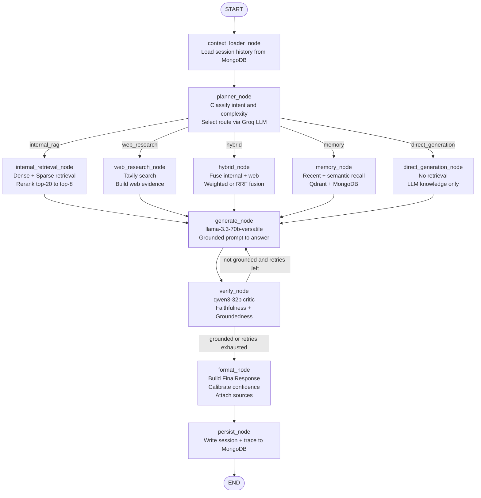
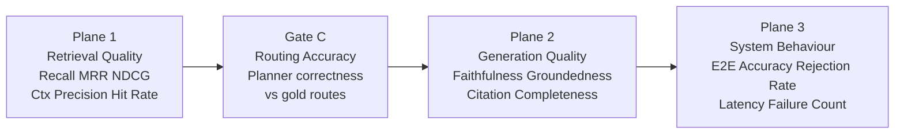

# Dynamic-RAG

**An evaluation-first adaptive retrieval-augmented generation system that routes, verifies, and measures every answer.**


---

## Description

Dynamic-RAG is an evaluation-first adaptive retrieval-augmented generation system that routes each incoming query through the most appropriate reasoning path — internal document retrieval, web research, conversation memory, hybrid fusion, or direct generation — rather than forcing every question through a single pipeline. At every stage, the system verifies the faithfulness of its own answers using an LLM-as-judge critic, and exposes a three-plane benchmark framework so that retrieval quality, generation accuracy, and system-level behaviour can be measured independently and reproducibly. Every routing decision, retrieval score, faithfulness verdict, and latency measurement is logged and traceable, making the system suitable for research, production integration, and iterative improvement. The architecture is orchestrated through a typed LangGraph state machine with bounded retry logic, ensuring deterministic control flow and explainable failure modes.

---

## What Makes It Different

Most RAG chatbots follow a single path: embed the query, retrieve top-k chunks, stuff a prompt, and generate. Dynamic-RAG takes a different approach:

- **Adaptive routing across five paths.** A dedicated planner node classifies every query and selects the most appropriate route: internal document retrieval, live web research via Tavily, hybrid dense-sparse fusion, conversation memory recall, or direct generation without retrieval. The system never routes a general knowledge question through the document store, and never answers a document-specific question from memory alone.
- **Evaluation-first by design, not as an afterthought.** Three independent evaluation planes measure retrieval quality (Recall@K, MRR, NDCG, Context Precision), generation quality (Faithfulness, Groundedness, Citation Accuracy, Completeness), and system-level behaviour (E2E Accuracy, Rejection Rate, Latency). A Gate C routing accuracy check ties them together. The current benchmark sits at Recall@K=0.87, Faithfulness=0.98, and E2E Accuracy=0.81 on a 30-document geopolitics corpus.
- **LangGraph orchestration with bounded retry.** The full pipeline is a typed state machine with conditional edges, a capped retry loop between the verifier and generator, and an explicit persist node that writes every session trace to MongoDB. There are no hidden side effects, no silent failures, and no unbounded loops.

---

## Key Features

- **Adaptive Intelligent Routing** — A Groq-powered planner (llama-3.1-8b-instant) classifies intent, estimates complexity, and selects one of five execution paths per query.
- **Hybrid Retrieval with Reranking** — Dense semantic search (BAAI/bge-small-en-v1.5, 384-dim cosine) fused with BM25 sparse retrieval. Configurable weighted fusion (dense 0.7 + sparse 0.3) or Reciprocal Rank Fusion. Twenty candidates are re-ranked by a cross-encoder (ms-marco-MiniLM-L-6-v2) and the top eight are passed to generation.
- **LangGraph State Machine** — Fully typed `QueryState` flows through nine named nodes with conditional branching, retry edges, and a structured `FinalResponse` output at every exit point.
- **Faithfulness Verification (LLM-as-Judge)** — Every generated answer is evaluated by a Qwen/Qwen3-32b critic that scores groundedness, identifies unsupported claims, and triggers a retry if confidence falls below threshold.
- **Conversation Memory with Summarisation** — Interaction history is stored in MongoDB and embedded in Qdrant for semantic recall. Long sessions are summarised to stay within context budgets. Memory is session-scoped to prevent cross-session leakage.
- **Three-Plane Evaluation Framework** — Plane 1 measures retrieval, Plane 2 measures generation, and Plane 3 measures end-to-end system behaviour. Gate C independently audits routing accuracy. All planes produce JSON reports to `evaluation/reports/`.
- **OCR for Scanned PDFs** — EasyOCR (1.7.2) is integrated into the ingestion pipeline so that image-only or scanned PDF pages are extracted and indexed alongside native-text documents.
- **Dynamic Corpus with Structured Metadata** — 4,888 chunks across 30 documents are indexed with rich metadata: document hash, version, pipeline version, page number, chunk index, and ingestion timestamp. Corpus composition is observable at runtime.
- **Cost and Token Tracking** — Token usage is recorded per query, per session, and aggregated system-wide. The `/system/metrics` endpoint exposes live cost and usage statistics.
- **Session Management and History** — Every session has a persistent ID. Query history, sources, and traces are retrievable via the REST API using `GET /chat/{session_id}` and `GET /query/{query_id}/sources`.
- **Production REST API and Streamlit UI** — A FastAPI server exposes fully documented endpoints for chat, document upload, health checking, and metrics. A Streamlit frontend provides an interactive research interface on top of the same backend.
- **Docker-Ready Configuration** — All services (FastAPI, MongoDB, Qdrant, Streamlit) are configured for Docker Compose deployment. Environment variables are managed through a single `.env` file.

---

## System Architecture

The full pipeline is orchestrated as a LangGraph directed graph. Each node receives the shared `QueryState` object, performs one bounded operation, and returns a partial state update. Conditional edges implement routing and retry logic.



### Node Responsibilities

| Node | Responsibility |
|---|---|
| `context_loader_node` | Fetches recent conversation turns and semantic memory for the current session |
| `planner_node` | Runs the Groq planner LLM to produce a `PlannerOutput` with route, confidence, and complexity |
| `internal_retrieval_node` | Executes dense + sparse retrieval, fuses scores, reranks, builds `EvidenceItem` list |
| `web_research_node` | Calls Tavily API, converts results to `EvidenceItem` with source type `web` |
| `hybrid_node` | Combines internal and web evidence using weighted fusion or RRF |
| `memory_node` | Retrieves session history and semantically similar past interactions |
| `direct_generation_node` | Passes the query to generation without retrieval evidence |
| `generate_node` | Builds a grounded prompt and calls the Groq generator LLM |
| `verify_node` | Calls the Groq critic LLM, parses faithfulness verdict, decides retry or proceed |
| `format_node` | Assembles the `FinalResponse` with calibrated confidence and cited sources |
| `persist_node` | Writes the complete session trace and query record to MongoDB |

---

## The Five Intelligent Routes

| Route | Trigger | Description |
|---|---|---|
| `internal_rag` | Query is about documents in the corpus; factual, definitional, or procedural questions | Dense semantic search fused with BM25 sparse retrieval over the Qdrant vector store. Top-20 candidates are re-ranked by a cross-encoder; the top-8 chunks are passed to generation. |
| `web_research` | Query requires current information, recent events, or data not in the local corpus | Tavily web search API returns ranked results with title, content, URL, and relevance score. Results are converted to `EvidenceItem` objects with source type `web`. |
| `hybrid` | Query spans both internal knowledge and external context; comparison or enrichment tasks | Internal retrieval and web research are executed in parallel. Evidence lists are merged using configurable weighted score fusion (default) or Reciprocal Rank Fusion. |
| `memory` | Query references prior conversation, uses pronouns referring to earlier turns, or asks to continue | Recent interaction history is fetched from MongoDB. Semantically similar past turns are retrieved from the Qdrant memory collection. Both are merged into a memory context block. |
| `direct_generation` | Query is a general reasoning task, text transformation, explanation, or question with no corpus dependency | No retrieval is performed. The query is sent directly to the generator LLM with instructions not to fabricate document-specific claims. |

---

## Evaluation Framework

Dynamic-RAG uses a three-plane evaluation architecture. Each plane measures a different layer of system quality. Gate C is an independent routing audit that can run in isolation.



### Latest Benchmark Results

Corpus: 30 documents, 4,888 chunks, geopolitics / Indian history / world affairs domain.

| Plane | Metric | Score |
|---|---|---|
| **Plane 1 — Retrieval** | Recall@K | 0.87 |
| **Plane 1 — Retrieval** | MRR (Mean Reciprocal Rank) | 1.00 |
| **Plane 1 — Retrieval** | Hit Rate | 1.00 |
| **Plane 1 — Retrieval** | Context Precision | 0.85 |
| **Gate C — Routing** | Routing Accuracy | 0.93 |
| **Plane 2 — Generation** | Faithfulness | 0.98 |
| **Plane 2 — Generation** | Groundedness | 1.00 |
| **Plane 2 — Generation** | Citation Accuracy | 0.99 |
| **Plane 2 — Generation** | Completeness | 0.85 |
| **Plane 3 — System** | End-to-End Accuracy | 0.81 |
| **Plane 3 — System** | Rejection Rate | 0.60 |
| **Plane 3 — System** | Failure Count | 0 |

All evaluation scripts are independent of the API and UI layers. Reports are written to `evaluation/reports/` as timestamped JSON files.

---

## Tech Stack

| Category | Technology | Version | Purpose |
|---|---|---|---|
| **Runtime** | Python | 3.11.9 | Core language |
| **Orchestration** | LangGraph | 1.2.4 | Typed state machine, conditional edges, bounded retry |
| **API Framework** | FastAPI | 0.136.3 | REST API server, OpenAPI docs, request validation |
| **UI** | Streamlit | 1.58.0 | Interactive research frontend |
| **Planner LLM** | Groq / llama-3.1-8b-instant | — | Fast query classification and route selection |
| **Generator LLM** | Groq / llama-3.3-70b-versatile | — | Grounded answer generation |
| **Critic LLM** | Groq / qwen/qwen3-32b | — | Faithfulness and groundedness verification |
| **Embeddings** | sentence-transformers / BAAI/bge-small-en-v1.5 | 5.5.1 | 384-dim dense embeddings, cosine similarity |
| **Reranker** | cross-encoder/ms-marco-MiniLM-L-6-v2 | — | Cross-encoder reranking of top-20 retrieval candidates |
| **Sparse Retrieval** | rank-bm25 | 0.2.2 | BM25 lexical retrieval |
| **Vector Database** | Qdrant | 1.18.0 | Dense vector storage, semantic search, memory collection |
| **Document Database** | MongoDB | 7.0 | Session storage, query traces, interaction history |
| **Web Search** | Tavily API | — | Live web research for current-events queries |
| **OCR** | EasyOCR | 1.7.2 | Text extraction from scanned and image-based PDFs |
| **Groq SDK** | groq | 1.4.0 | Unified client for all Groq LLM calls |

---

## Quick Start

### 1. Clone and Install Dependencies

```bash
git clone https://github.com/Divij2601/Dynamic-RAG.git
cd Dynamic-RAG

python -m venv .venv
# On Linux / macOS:
source .venv/bin/activate
# On Windows:
.venv\Scripts\activate

pip install -r requirements.txt
```

### 2. Configure Environment Variables

Create a `.env` file in the project root. Copy from `.env.example` and fill in your keys:

```env
# LLM Provider
GROQ_API_KEY=gsk_your_groq_api_key_here

# Web Search
TAVILY_API_KEY=tvly_your_tavily_api_key_here

# Vector Database
QDRANT_HOST=localhost
QDRANT_PORT=6333
QDRANT_COLLECTION_NAME=dynamic_rag_docs

# Document Database
MONGODB_URI=mongodb://localhost:27017
MONGODB_DB_NAME=dynamic_rag

# Retrieval Settings
RERANK_TOP_K=20
FINAL_TOP_K=8
FUSION_MODE=weighted
DENSE_WEIGHT=0.7
SPARSE_WEIGHT=0.3

# Generation Settings
GENERATOR_MODEL=llama-3.3-70b-versatile
PLANNER_MODEL=llama-3.1-8b-instant
CRITIC_MODEL=qwen/qwen3-32b
GENERATION_TEMPERATURE=0.1

# Embedding
EMBEDDING_MODEL=BAAI/bge-small-en-v1.5
EMBEDDING_DIM=384
```

### 3. Start Services

```bash
# Start MongoDB (if not running as a system service)
mongod --dbpath ./data/mongo

# Start Qdrant (Docker recommended)
docker run -p 6333:6333 -v $(pwd)/data/qdrant_storage:/qdrant/storage qdrant/qdrant

# Start the FastAPI backend
uvicorn src.api.main:app --host 0.0.0.0 --port 8000 --reload

# Start the Streamlit frontend (in a separate terminal)
streamlit run app.py --server.port 8501
```

### 4. Verify the Installation

```python
import httpx

# Check API health
response = httpx.get("http://localhost:8000/health")
print(response.json())
# Expected: {"status": "healthy", "version": "...", "services": {...}}

# Submit a query
response = httpx.post(
    "http://localhost:8000/chat/query",
    json={
        "query": "What is the significance of the Belt and Road Initiative?",
        "session_id": "test-session-001"
    }
)
print(response.json())
```

The Streamlit UI will be available at `http://localhost:8501`.
The FastAPI interactive docs (Swagger UI) will be available at `http://localhost:8000/docs`.

---

## Project Structure

```
Dynamic-RAG/
|
+-- src/                            # All application source code
|   +-- config.py                   # Pydantic settings, loads .env, typed config object
|   |
|   +-- api/                        # FastAPI application
|   |   +-- main.py                 # App factory, middleware, startup/shutdown hooks
|   |   +-- routes/
|   |   |   +-- health.py           # GET /health — liveness and dependency checks
|   |   |   +-- chat.py             # POST /chat/query, GET /chat/{session_id}
|   |   |   +-- documents.py        # POST /documents/upload — ingestion trigger
|   |   |   +-- metrics.py          # GET /system/metrics — live usage and cost stats
|   |   +-- schemas/                # Pydantic request/response models for all routes
|   |
|   +-- graph/
|   |   +-- state.py                # QueryState, PlannerOutput, EvidenceItem, FinalResponse
|   |
|   +-- planner/
|   |   +-- planner.py              # Groq-powered intent classification and route selection
|   |   +-- router.py               # Dispatches to the correct route handler
|   |   +-- heuristics.py           # Fast regex/keyword rules for pre-LLM classification
|   |
|   +-- retrieval/
|   |   +-- dense.py                # Qdrant dense vector search using bge-small-en-v1.5
|   |   +-- sparse.py               # BM25 lexical retrieval using rank-bm25
|   |   +-- hybrid.py               # Weighted fusion and RRF score combination
|   |   +-- reranker.py             # Cross-encoder reranking (ms-marco-MiniLM-L-6-v2)
|   |   +-- evidence.py             # Converts retrieval results to EvidenceItem objects
|   |
|   +-- generation/
|   |   +-- prompt_builder.py       # Grounded prompt assembly from evidence + memory
|   |   +-- generator.py            # Groq generation call, response parsing
|   |   +-- verifier.py             # LLM-as-judge faithfulness and groundedness scoring
|   |   +-- response_builder.py     # FinalResponse construction and confidence calibration
|   |
|   +-- memory/
|   |   +-- store.py                # Save and retrieve interactions from MongoDB
|   |   +-- retriever.py            # Merge recent and semantic memory into context block
|   |   +-- semantic.py             # Qdrant-backed semantic memory search
|   |   +-- summarizer.py           # Long-session context compression
|   |
|   +-- ingestion/
|   |   +-- loader.py               # File validation, storage, document ID assignment
|   |   +-- parser.py               # PDF (PyMuPDF + EasyOCR) and TXT extraction
|   |   +-- chunker.py              # Sliding-window semantic chunking with overlap
|   |   +-- metadata.py             # Hash, version, timestamp, and pipeline metadata
|   |   +-- embedder.py             # sentence-transformers batch embedding
|   |   +-- indexer.py              # Qdrant collection management and point insertion
|   |
|   +-- web/
|   |   +-- search.py               # Tavily API client wrapper
|   |   +-- evidence.py             # Web result to EvidenceItem conversion
|   |
|   +-- database/
|   |   +-- mongo_client.py         # MongoDB connection and ping
|   |   +-- qdrant_client.py        # Qdrant connection and ping
|   |   +-- repositories.py         # Session, query, trace, and memory repositories
|   |
|   +-- observability/
|       +-- logger.py               # Structured JSON logger, rotating file handler
|       +-- tracing.py              # Request ID generation, span timing utilities
|       +-- metrics.py              # In-memory counters for tokens, latency, failures
|
+-- evaluation/                     # Standalone evaluation framework
|   +-- schemas.py                  # BenchmarkSample, MetricResult, EvaluationReport
|   +-- retrieval_eval.py           # Plane 1: Recall@K, MRR, NDCG, Context Precision
|   +-- generation_eval.py          # Plane 2: Faithfulness, Groundedness, Citation, Completeness
|   +-- system_eval.py              # Plane 3: E2E Accuracy, Rejection Rate, Latency, Failures
|   +-- runner.py                   # Orchestrates all three planes, writes JSON report
|   +-- data/
|   |   +-- test_set.json           # Benchmark dataset: query, ground_truth, chunk_ids, answerable
|   +-- reports/                    # Timestamped JSON evaluation reports
|   +-- utils/
|       +-- metrics.py              # Shared metric calculation utilities
|
+-- data/
|   +-- raw/
|   |   +-- primary/                # Source documents for retrieval (geopolitics corpus)
|   |   +-- noise/                  # Distractor documents for retrieval precision testing
|   |   +-- unanswerable/           # Docs that should NOT answer benchmark queries
|   +-- processed/
|   |   +-- parsed/                 # Extracted page text from ingestion pipeline
|   |   +-- chunks/                 # Chunk JSON outputs with metadata
|   |   +-- embeddings/             # Optional debug embedding outputs
|   +-- uploads/                    # Runtime document upload staging area
|
+-- tests/                          # Pytest test suite
|   +-- test_config.py
|   +-- test_chunker.py             # Chunker determinism, size, sentence splitting
|   +-- test_confidence.py          # Confidence calibration (incl. negative-logit regression)
|   +-- test_metadata.py            # Metadata enrichment + content hashing
|   +-- test_parsing.py             # Verifier verdict + planner JSON parsing
|   +-- test_retrieval_metrics.py   # Recall@K, MRR, NDCG, Hit Rate, Precision
|   +-- test_groq_provider.py       # Retry / backoff / fallback (mocked)
|   +-- test_integration.py         # Live API, retrieval, end-to-end (marked)
|
+-- logs/                           # Runtime log files (gitignored)
|   +-- dynamic_rag.log
|
+-- docs/                           # User & developer guides
|   +-- SETUP.md                    # Installation and configuration
|   +-- ARCHITECTURE.md             # LangGraph nodes, state design, retrieval pipeline
|   +-- USAGE.md                    # Running the stack, UI tour, API usage
|   +-- EVALUATION.md               # 3-plane evaluation framework and metrics
|   +-- CORPUS_GUIDE.md             # Building and managing the document corpus
|   +-- API_REFERENCE.md            # Full REST API endpoint reference
|
+-- design/                         # Original engineering design specifications
|   +-- PROJECT_ARCHITECTURE.md     # Architectural vision and layered design
|   +-- SYSTEM_DESIGN.md            # Implementation blueprint and data models
|   +-- ROADMAP.md                  # Phased build order and evaluation gates
|   +-- EVALUATION_AND_OBSERVABILITY.md  # Evaluation + observability strategy
|
+-- app.py                          # Streamlit frontend entry point
+-- pytest.ini                      # Pytest configuration
+-- requirements.txt                # Python dependencies
+-- .env.example                    # Template for environment variables
+-- .gitignore                      # Excludes .env, logs/, data/uploads/, __pycache__/
+-- CLAUDE.md                       # Agent operating context and test playbook
+-- README.md                       # This file
```

---

## API Reference

The FastAPI server exposes the following endpoints. Full documentation is available at `http://localhost:8000/docs` when the server is running.

| Method | Endpoint | Description |
|---|---|---|
| `GET` | `/health` | Liveness check. Returns status of API, MongoDB, and Qdrant. |
| `POST` | `/chat/query` | Submit a query. Body: `{"query": str, "session_id": str}`. Returns `FinalResponse`. |
| `GET` | `/chat/{session_id}` | Retrieve full conversation history for a session. |
| `GET` | `/query/{query_id}/sources` | Retrieve the evidence sources used for a specific query. |
| `POST` | `/documents/upload` | Upload a document (PDF or TXT) and trigger ingestion. Multipart form. |
| `GET` | `/system/metrics` | Live system metrics: token usage, query count, latency percentiles, failure count. |

---

## Running Evaluations

All evaluation scripts are independent of the API and UI. They can be run directly against the database and retrieval layer.

```bash
# Run the full three-plane benchmark
python -m evaluation.runner

# Run only retrieval evaluation (Plane 1)
python -m evaluation.retrieval_eval

# Run only generation evaluation (Plane 2)
python -m evaluation.generation_eval

# Run only system evaluation (Plane 3)
python -m evaluation.system_eval
```

Reports are written to `evaluation/reports/` as `dynamic_rag_<timestamp>.json`.

To add new benchmark samples, edit `evaluation/data/test_set.json`. Each sample follows this schema:

```json
{
  "query": "What was the primary cause of the 2008 financial crisis?",
  "ground_truth_answer": "The collapse of mortgage-backed securities...",
  "relevant_chunk_ids": ["chunk_abc123", "chunk_def456"],
  "answerable": true,
  "metadata": {
    "domain": "economics",
    "difficulty": "medium",
    "query_type": "factual"
  }
}
```

---

## Documentation

**User & developer guides** (`docs/`):

| Document | Description |
|---|---|
| [SETUP.md](docs/SETUP.md) | Step-by-step installation, dependency configuration, and service setup for local and Docker environments |
| [ARCHITECTURE.md](docs/ARCHITECTURE.md) | Deep dive into the LangGraph state machine, node contracts, `QueryState` schema, and retry logic design |
| [USAGE.md](docs/USAGE.md) | End-to-end usage guide: ingesting documents, submitting queries, reading responses, managing sessions |
| [EVALUATION.md](docs/EVALUATION.md) | Evaluation methodology, metric definitions, benchmark dataset format, and interpreting reports |
| [CORPUS_GUIDE.md](docs/CORPUS_GUIDE.md) | How to build a structured benchmark corpus, naming conventions, recommended document types |
| [API_REFERENCE.md](docs/API_REFERENCE.md) | Full REST API reference with request/response schemas, error codes, and example curl commands |
| [CONTRIBUTING.md](CONTRIBUTING.md) | Development setup, code style, and how to add routes, metrics, or file types |

**Original design specifications** (`design/`) — the engineering intent the system was built against:

| Document | Description |
|---|---|
| [PROJECT_ARCHITECTURE.md](design/PROJECT_ARCHITECTURE.md) | Original architectural vision and layered design |
| [SYSTEM_DESIGN.md](design/SYSTEM_DESIGN.md) | Technical implementation blueprint and data models |
| [ROADMAP.md](design/ROADMAP.md) | Phased build order and evaluation gates |
| [EVALUATION_AND_OBSERVABILITY.md](design/EVALUATION_AND_OBSERVABILITY.md) | Evaluation framework and observability strategy |

---

## Contributing

Contributions are welcome. Before submitting a pull request:

1. Run the full test suite: `pytest tests/ -v`
2. Run the evaluation benchmark and include the report output in your PR description
3. Ensure all new code follows the existing typed schema pattern (`QueryState`, `EvidenceItem`, `FinalResponse`)
4. Do not add retrieval or generation logic outside of the designated module boundaries
5. All LLM calls must go through `src/models/groq_provider.py` — no direct `groq` client calls in route or generation modules

---

## License

This project is licensed under the MIT License.

```
MIT License

Copyright (c) 2026 Divij Dudeja

Permission is hereby granted, free of charge, to any person obtaining a copy
of this software and associated documentation files (the "Software"), to deal
in the Software without restriction, including without limitation the rights
to use, copy, modify, merge, publish, distribute, sublicense, and/or sell
copies of the Software, and to permit persons to whom the Software is
furnished to do so, subject to the following conditions:

The above copyright notice and this permission notice shall be included in all
copies or substantial portions of the Software.

THE SOFTWARE IS PROVIDED "AS IS", WITHOUT WARRANTY OF ANY KIND, EXPRESS OR
IMPLIED, INCLUDING BUT NOT LIMITED TO THE WARRANTIES OF MERCHANTABILITY,
FITNESS FOR A PARTICULAR PURPOSE AND NONINFRINGEMENT. IN NO EVENT SHALL THE
AUTHORS OR COPYRIGHT HOLDERS BE LIABLE FOR ANY CLAIM, DAMAGES OR OTHER
LIABILITY, WHETHER IN AN ACTION OF CONTRACT, TORT OR OTHERWISE, ARISING FROM,
OUT OF OR IN CONNECTION WITH THE SOFTWARE OR THE USE OR OTHER DEALINGS IN THE
SOFTWARE.
```
