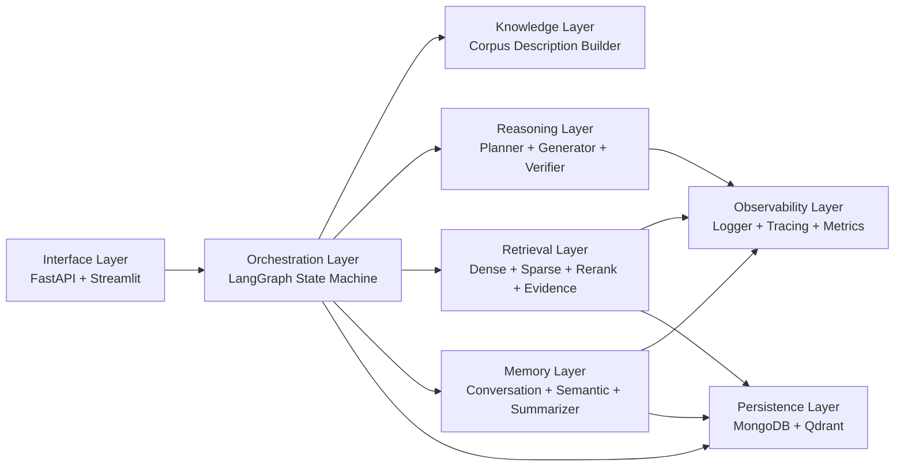
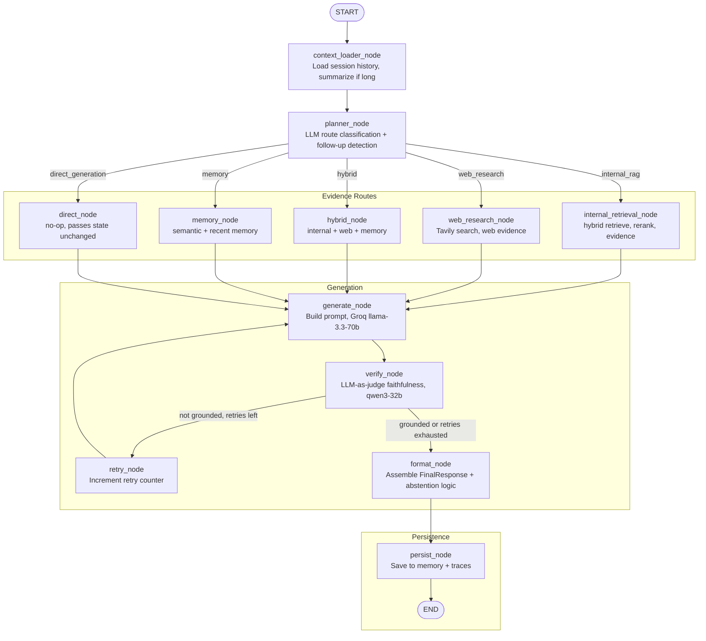
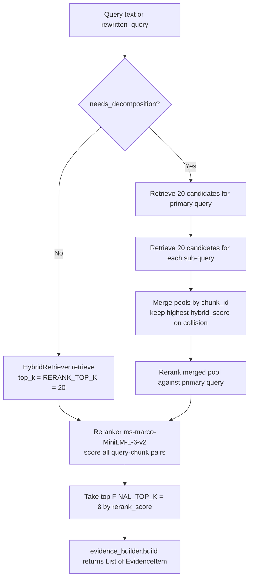
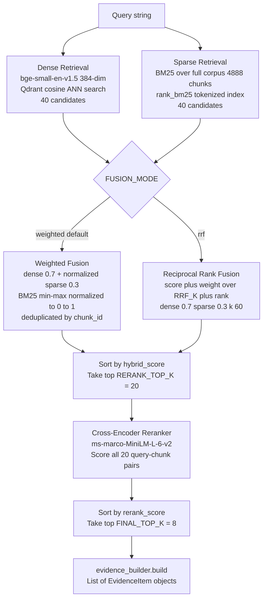
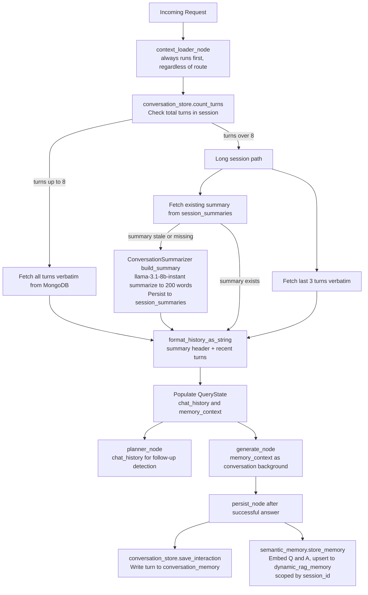

# Dynamic-RAG — Architecture Reference

> Deep technical documentation for contributors, evaluators, and operators.
> Last updated: 2026-06-07. Python 3.11.9.

---

## Table of Contents

1. [Design Philosophy](#1-design-philosophy)
2. [System Layers](#2-system-layers)
3. [The LangGraph State Machine](#3-the-langgraph-state-machine)
4. [Node Responsibilities](#4-node-responsibilities)
5. [The Five Routes](#5-the-five-routes)
6. [Retrieval Pipeline Deep Dive](#6-retrieval-pipeline-deep-dive)
7. [Conversation Memory Architecture](#7-conversation-memory-architecture)
8. [Key Data Objects](#8-key-data-objects)
9. [Dynamic Corpus Description](#9-dynamic-corpus-description)
10. [Storage Design](#10-storage-design)

---

## 1. Design Philosophy

Dynamic-RAG is built around four non-negotiable architectural commitments. These are not aspirational goals — they are structural constraints that every component must satisfy.

### 1.1 Adaptive — Take the Lightest Correct Path

The system exposes five distinct execution routes: `internal_rag`, `web_research`, `hybrid`, `memory`, and `direct_generation`. Every query is routed through the most efficient path that can correctly answer it. A question answerable from the local corpus never calls the web search API. A conversational follow-up that only requires memory context never triggers document retrieval. A creative writing or summarisation task never touches a vector database.

This matters because route selection is a form of resource budgeting. Unnecessary retrievals add latency, consume LLM tokens, and introduce noise evidence that degrades generation quality. The adaptive design prevents these failure modes by making route selection an explicit, observable, and measurable decision made before any retrieval begins.

### 1.2 Grounded — Evidence-Only Answers

For all evidence-based routes (`internal_rag`, `web_research`, `hybrid`), the generator is explicitly instructed to answer only from the retrieved evidence and to abstain when that evidence is insufficient. A separate LLM-as-judge step (the Faithfulness Verifier) independently scores the generated answer against the evidence and can trigger a retry or force an abstention.

This matters because hallucination is the primary quality failure mode in RAG systems. An ungrounded answer is not a degraded answer — it is a trust-destroying answer. The system treats groundedness as a binary gate, not a continuous quality metric: if an answer cannot be supported, the system says so explicitly rather than generating plausible-sounding fabrications.

### 1.3 Observable — Every Decision Traced

Every request generates a structured trace document written to MongoDB. The trace records: the route taken, retrieval latency, generation latency, faithfulness score, groundedness verdict, confidence score, retry count, the full list of evidence sources (with chunk IDs, page numbers, and document IDs), token usage, and estimated cost. The planner's route decision is logged at INFO level. The verifier's verdict is logged at SUCCESS level. Every cache invalidation event is logged. Every LLM retry is logged with the wait duration.

This matters because a RAG system that cannot explain its decisions cannot be improved. Observability is the prerequisite for all other quality work: you cannot improve what you cannot measure, and you cannot debug what you cannot trace.

### 1.4 Accountable — Three-Plane Measurable Evaluation

The evaluation system is structured as three independent measurement planes:

- **Plane 1 (Retrieval Quality):** Recall@K, MRR, NDCG@K, Hit Rate, Context Precision, Context Recall. Current benchmark: Recall@K=0.9338, MRR=1.0, Hit Rate=1.0, Context Precision=0.9266, NDCG@K=0.9538.
- **Plane 2 (Generation Quality):** Faithfulness, Groundedness, Answer Relevance, Completeness, Citation Accuracy. Current benchmark: Faithfulness=0.9899, Groundedness=0.9873, Citation Accuracy=0.9886, Completeness=0.8494.
- **Plane 3 (System Quality):** End-to-End Accuracy, Rejection Rate, Failure Count, Routing Accuracy. Current benchmark: E2E Accuracy=0.8437, Rejection Rate=0.3333, Failure Count=0, Routing Accuracy=0.9888.

These planes are independently executable and produce JSON reports to `evaluation/reports/`. The three-plane structure means retrieval improvements can be measured without contaminating generation metrics, and vice versa. This matters because it enables disciplined experimentation: change one subsystem, re-run one plane, and get a clean signal.

---

## 2. System Layers

The system is organized into eight layers with clear separation of concerns. Each layer depends only on layers below it, with the exception of the Observability layer which is used horizontally across all layers.



### Interface Layer

Contains `src/api/main.py` and the Streamlit UI. The FastAPI application exposes six endpoints: `GET /health`, `POST /chat/query`, `GET /chat/{session_id}`, `GET /query/{query_id}/sources`, `POST /documents/upload`, and `GET /system/metrics`. All blocking operations (graph execution, ingestion) run as synchronous endpoints, which FastAPI automatically dispatches to a thread pool to avoid stalling the event loop. The Interface Layer is responsible for request validation, error translation, and response serialization. It never contains business logic.

### Orchestration Layer

Contains `src/graph/graph_builder.py`, `src/graph/nodes.py`, and `src/graph/router.py`. This is the LangGraph state machine. It is the only layer that sequences execution across other layers. The graph is compiled once at import time (`dynamic_rag_graph = build_graph()`) and shared across all requests. The Orchestration Layer owns the `QueryState` object, which flows through every node as the single source of truth for a request's lifecycle.

### Knowledge Layer

Contains `src/knowledge/corpus_description.py`. This layer is responsible for maintaining an always-current, natural-language description of what is in the Qdrant vector store. It has no external callers except the Planner; it is invalidated automatically by the Ingestion Pipeline whenever a new document is indexed. See Section 9 for full details.

### Reasoning Layer

Contains `src/planner/planner.py`, `src/planner/heuristics.py`, `src/generation/generator.py`, `src/generation/verifier.py`, `src/generation/prompt_builder.py`, and `src/generation/response_builder.py`. This layer makes all LLM calls. The Planner decides route and query rewriting. The Generator produces candidate answers. The Verifier independently judges grounding. The Prompt Builder assembles structured, evidence-grounded prompts. The Response Builder assembles the final `FinalResponse` object.

### Retrieval Layer

Contains `src/retrieval/dense.py`, `src/retrieval/sparse.py`, `src/retrieval/hybrid.py`, `src/retrieval/reranker.py`, and `src/retrieval/evidence.py`. This layer is responsible for finding the best chunks from the indexed corpus. It is used only by the `internal_retrieval_node` and `hybrid_node`. It never calls LLMs.

### Memory Layer

Contains `src/memory/store.py`, `src/memory/semantic.py`, `src/memory/retriever.py`, and `src/memory/summarizer.py`. This layer manages two memory scopes: short-term conversation history (MongoDB) and long-term semantic memory (Qdrant). It is invoked by the `context_loader_node` at the start of every request and by the `persist_node` at the end of every successful request.

### Observability Layer

Contains `src/observability/logger.py`, `src/observability/tracing.py`, and `src/observability/metrics.py`. This layer is used horizontally — every other layer imports `app_logger`. The logger uses `loguru` with structured output. The tracing module provides `generate_request_id()` (UUID-based, `req_` prefixed) and a `trace_execution()` context manager. This layer never calls other layers.

### Persistence Layer

Contains `src/database/mongo_client.py`, `src/database/qdrant_client.py`, and `src/database/repositories.py`. This layer owns the connection lifecycle for both databases. Both clients are singletons initialized lazily on first access. Qdrant stores document chunk vectors (384-dim cosine) and semantic memory vectors. MongoDB stores conversation turns, session metadata, session summaries, document metadata, and request traces.

---

## 3. The LangGraph State Machine

The core of Dynamic-RAG is a compiled LangGraph `StateGraph` over `QueryState`. The graph is deterministic: given the same state and the same planner output, it always executes the same sequence of nodes. The only non-deterministic branching points are the two conditional edges, which inspect state fields to choose the next node.

### Full Node Graph



### Conditional Edge 1: route_after_planner

Reads `state.planner_output.route` and maps it to one of the five evidence nodes. Falls back to `internal_retrieval` if the route is missing or unrecognized. The mapping is:

```
internal_rag        → internal_retrieval
web_research        → web_research
hybrid              → hybrid
memory              → memory
direct_generation   → direct
```

### Conditional Edge 2: route_after_verify

Reads `state.verification_result["grounded"]` and `state.retry_count`. Logic:

- If `selected_route` is not in `{internal_rag, web_research, hybrid}`: always go to `format` (non-evidence routes skip grounding checks).
- If `grounded is False` AND `retry_count < MAX_RETRIES` (default: 2): go to `retry`.
- Otherwise: go to `format`.

The retry loop adds a strictness instruction to the generation prompt on each attempt, instructing the model to only claim what is directly supported by the evidence.

---

## 4. Node Responsibilities

### context_loader_node

**Inputs from state:** `session_id`

**What it does:** Calls `conversation_summariser.get_context_for_session(session_id)`. This inspects the session's total turn count in MongoDB. If `total_turns <= MAX_HISTORY_TURNS` (default: 8), all turns are returned verbatim. If `total_turns > 8`, the older turns are compressed into a rolling summary using `llama-3.1-8b-instant` (the fast model), and only the last `SUMMARY_KEEP_RECENT` (default: 3) turns are kept verbatim. The node then formats the summary and recent turns into a human-readable `memory_context` string and a structured `chat_history` list.

**Outputs to state:** `chat_history` (list of `{query, answer}` dicts), `memory_context` (formatted string with summary header and recent turns).

**Failure behavior:** If MongoDB is unavailable or the summarizer fails, the node returns an empty dict — the request continues with empty history. This is a safe degradation because the planner works without history; it just cannot detect follow-up patterns.

---

### planner_node

**Inputs from state:** `query_text`, `chat_history`

**What it does:** Calls `query_planner.plan(query, chat_history)`. The planner first calls `corpus_description_builder.get_description()` to get a live snapshot of what the knowledge base contains. It then builds a structured prompt that includes the corpus description, the last 5 turns of conversation history (truncated to 200 chars per answer), and detailed instructions for the five route types. The prompt asks the LLM (`llama-3.1-8b-instant`, temperature=0.0) to respond with a single JSON object. The response is parsed, the route is validated against the five valid route names, and a `PlannerOutput` is assembled. If the LLM returns an invalid route, the heuristic classifier provides a fallback. If the LLM call fails entirely, the heuristic classifier takes over with confidence=0.5.

**Outputs to state:** `planner_output` (full `PlannerOutput`), `selected_route` (string).

**Failure behavior:** Falls back to `QueryHeuristics.classify(query)` — a keyword-pattern classifier that always returns one of the five valid routes.

---

### internal_retrieval_node

**Inputs from state:** `planner_output` (for `needs_decomposition` and `subqueries`), `query_text` (or `planner_output.rewritten_query` if the planner detected a follow-up).

**What it does:** Checks if the planner flagged `needs_decomposition=True` with populated `subqueries`. If yes, calls `_retrieve_with_decomposition`: retrieves `RERANK_TOP_K=20` candidates for the primary query and for each sub-query independently, merges all chunks into a single pool (deduplicating by `chunk_id`, keeping the higher hybrid score on collision), then reranks the merged pool against the primary query. If no decomposition is needed, calls `_retrieve_internal`: a single hybrid retrieval of 20 candidates followed by cross-encoder reranking. Either path produces a list of `EvidenceItem` objects.

**Outputs to state:** `internal_evidence` (list of `EvidenceItem`), `retrieval_metrics` (with `retrieval_latency_ms`).

**Failure behavior:** If Qdrant is unavailable, the retrieval call raises an exception that propagates to the graph runner. The graph catches it and returns a `FinalResponse` with `status="error"`. This is intentionally not silenced because internal retrieval failure is a hard failure for the `internal_rag` route.

---

### web_research_node

**Inputs from state:** `query_text` (or rewritten query from planner).

**What it does:** Calls `web_search_agent.search(query)` which invokes the Tavily API with the effective query. Returns up to `WEB_TOP_K=5` web results (title, content, URL, score). Each result is converted to an `EvidenceItem` with `source_type="web"` and metadata containing `title` and `url`.

**Outputs to state:** `web_evidence` (list of `EvidenceItem`), `retrieval_metrics`.

**Failure behavior:** Tavily failures are caught and logged; `web_evidence` is set to an empty list. The pipeline continues to generation, which will abstain due to lack of evidence.

---

### hybrid_node

**Inputs from state:** `query_text` (or rewritten query), `session_id`.

**What it does:** Runs all three evidence sources in sequence within a single node: internal hybrid retrieval (same as `internal_retrieval_node`), Tavily web search (same as `web_research_node`), and memory retrieval via `memory_retriever.retrieve_context`. All three are combined. The web portion is wrapped in a try/except so a Tavily failure does not abort internal retrieval.

**Outputs to state:** `internal_evidence`, `web_evidence`, `memory_context` (overwritten with semantic+recent merge), `retrieval_metrics`.

**Failure behavior:** Web failures are caught and logged; the node continues with whatever evidence was collected.

---

### memory_node

**Inputs from state:** `session_id`, `query_text`.

**What it does:** Calls `memory_retriever.retrieve_context(session_id, query_text)`. This merges two sources: recent conversation turns from MongoDB (the short-term store) and semantically similar past interactions from Qdrant (the long-term semantic memory store, collection `dynamic_rag_memory`). The semantic memory search uses a session-scoped Qdrant filter to prevent cross-session leakage.

**Outputs to state:** `memory_context` (formatted combined string).

**Failure behavior:** Failures return an empty string; the generator falls back to the context already loaded by `context_loader_node`.

---

### direct_node

**Inputs from state:** none (reads nothing).

**What it does:** A no-op. Returns an empty dict. The state passes through unchanged. This is the explicit "no retrieval" path for general language tasks.

**Outputs to state:** none.

**Failure behavior:** Cannot fail.

---

### generate_node

**Inputs from state:** `selected_route`, `query_text`, `internal_evidence`, `web_evidence`, `memory_context`, `retry_count`.

**What it does:** Branches on `selected_route`. For `direct_generation` and `memory` routes: builds a non-grounded prompt that includes `memory_context` as conversational background (explicitly labeled as not evidence) and the raw query. For all evidence routes (`internal_rag`, `web_research`, `hybrid`): calls `prompt_builder.build_prompt(query, internal_evidence, web_evidence, memory_context)` which assembles a structured prompt with numbered evidence blocks, source labels, and an instruction to abstain if evidence is insufficient. If `retry_count > 0`, appends a strictness instruction to the evidence prompt. Calls `response_generator.generate(prompt)` which invokes `groq_provider.complete` with `llama-3.3-70b-versatile` at `TEMPERATURE=0.2`.

**Outputs to state:** `candidate_answer` (raw string), `generation_metrics` (with `generation_latency_ms`).

**Failure behavior:** Groq client errors propagate upward. The `GroqProvider` handles rate limits with exponential backoff (up to `LLM_RETRY_MAX_WAIT=30s`) and a one-shot fallback to `llama-3.1-8b-instant` if the primary model is rate-limited beyond the wait threshold.

---

### verify_node

**Inputs from state:** `selected_route`, `candidate_answer`, `internal_evidence`, `web_evidence`.

**What it does:** For non-evidence routes (`direct_generation`, `memory`): returns a synthetic verdict with `faithful=True`, `grounded=True`, `faithfulness_score=None` and a note that the check was skipped. For evidence routes: concatenates `internal_evidence` and `web_evidence` into a single block. If the combined block is empty, returns `faithful=False, grounded=False`. Otherwise calls `faithfulness_verifier.verify(query, answer, evidence_items)`. The verifier sends the answer and evidence to `qwen/qwen3-32b` (temperature=0.0) with a strict judge prompt. The model returns JSON with `faithfulness_score`, `grounded`, `unsupported_claims`, and `reasoning`. The parser extracts the first balanced `{...}` block, strips markdown fences, and validates the score is in [0.0, 1.0]. `faithful` is set to `True` only if `grounded=True` AND `faithfulness_score >= 0.7`.

**Outputs to state:** `verification_result` (dict with keys: `faithful`, `grounded`, `faithfulness_score`, `unsupported_claims`, `reasoning`).

**Failure behavior:** Any parsing or LLM error results in a permissive fallback verdict (`faithful=True, grounded=True, faithfulness_score=None`) so the pipeline continues. The failure is logged at ERROR level.

---

### retry_node

**Inputs from state:** `retry_count`.

**What it does:** Increments `retry_count` by 1. Logs the current retry number against `MAX_RETRIES`. This node exists as an explicit node (rather than inline in the conditional edge) so the retry event is visible in LangGraph's execution trace.

**Outputs to state:** `retry_count` (incremented).

**Failure behavior:** Cannot fail.

---

### format_node

**Inputs from state:** `selected_route`, `candidate_answer`, `internal_evidence`, `web_evidence`, `verification_result`, `request_id`, `session_id`.

**What it does:** Determines whether to return the answer or abstain. Abstention is triggered if: (a) the `candidate_answer` contains the phrase "sufficient evidence" and "could not" (the model self-abstained), OR (b) the route is an evidence route and `verification_result["grounded"] is False`. If abstaining, the answer is replaced with the constant `ABSTAIN_MESSAGE`. Then calls `response_builder.build(answer, route, evidence_items, verification, status, query_id, session_id)` which assembles the `FinalResponse` with confidence calibration applied.

**Outputs to state:** `final_response` (`FinalResponse` object).

**Failure behavior:** If `candidate_answer` is None, uses an empty string. The node does not raise.

---

### persist_node

**Inputs from state:** `final_response`, `session_id`, `query_text`, `request_id`, `retrieval_metrics`, `generation_metrics`, `retry_count`.

**What it does:** Three best-effort writes, each independently try/except'd so a storage failure never fails the request:
1. `conversation_store.save_interaction(session_id, query, answer, route, confidence, query_id)` — writes one turn to MongoDB `conversation_memory`.
2. If `final_response.status == "success"`: `semantic_memory.store_memory(session_id, query, answer)` — embeds the Q+A pair and upserts into Qdrant `dynamic_rag_memory` for future semantic recall.
3. Assembles a full trace document (request_id, session_id, query, route, latencies, faithfulness, grounded, confidence, retry_count, status, num_sources, sources list, token_usage, total_cost_usd) and inserts into MongoDB `traces`.

**Outputs to state:** none (returns empty dict).

**Failure behavior:** All failures are logged at ERROR level and silently swallowed. The `final_response` in state is not modified.

---

## 5. The Five Routes

### Route 1: internal_rag

**Trigger conditions:** The query asks about facts, history, concepts, definitions, or analysis that exist within the indexed document corpus. Examples: geopolitical events, country profiles, historical periods, treaty details, military history, political science concepts, content from any uploaded document.

**Example queries:** "What caused the Cuban Missile Crisis?", "Explain India's approach to non-alignment", "What does the NPT treaty establish?", "Summarize the key findings in document X."

**What the node does:** Performs hybrid retrieval (dense + sparse fusion) over the full Qdrant collection, reranks with a cross-encoder, converts top chunks to `EvidenceItem` objects. If the planner set `needs_decomposition=True`, each sub-query retrieves independently and the pools are merged before reranking.

**Evidence sources:** Qdrant `dynamic_rag_documents` collection only.

**Internal RAG route — detailed flow:**



---

### Route 2: web_research

**Trigger conditions:** The query requires current, real-time, or rapidly changing data that the static corpus cannot contain. Specifically: live prices (stock, crypto, commodity), sports results or live scores, today's news or breaking events, current population or economic statistics, weather forecasts, recent elections, current company leadership (CEO/CFO), or any fact with a temporal component beyond the corpus upload dates.

**Example queries:** "What is Apple's current stock price?", "Who won yesterday's IPL match?", "Latest inflation figures for India", "Current US Secretary of State."

**What the node does:** Calls Tavily search API with the effective query. Returns up to 5 results. Each result is wrapped in an `EvidenceItem` with `source_type="web"`.

**Evidence sources:** Tavily API (live web search).

---

### Route 3: hybrid

**Trigger conditions:** The query requires both grounding in the static corpus AND current web information. This is the most expensive route and is used sparingly. Examples: comparing a corpus document's historical analysis to current events, or enriching a factual explanation with the latest developments.

**Example queries:** "Compare India's historical non-alignment stance with its current foreign policy positions", "How has China's Belt and Road Initiative evolved since the documents in our corpus were written?"

**What the node does:** Runs internal hybrid retrieval, Tavily web search, and memory retrieval all within a single node. All three evidence sources are populated in state and passed to the generator as a combined evidence block.

**Evidence sources:** Qdrant `dynamic_rag_documents` + Tavily API + semantic memory.

---

### Route 4: memory

**Trigger conditions:** The query explicitly refers back to the earlier conversation. Signal phrases: "what did we discuss", "you said earlier", "previously", "same as before", "continue from where we left off". This is distinct from a follow-up query that can be rewritten (the planner rewrites those into standalone queries and routes them to `internal_rag` or `web_research`).

**Example queries:** "Summarize our conversation so far", "What was the conclusion you gave earlier?", "Remind me of what we were discussing."

**What the node does:** Calls `memory_retriever.retrieve_context(session_id, query_text)` which merges recent MongoDB turns with semantically similar Qdrant memory vectors scoped to the current session.

**Evidence sources:** MongoDB `conversation_memory` + Qdrant `dynamic_rag_memory`.

---

### Route 5: direct_generation

**Trigger conditions:** The query is a general language task with no retrieval requirement. Examples: rewriting, translation, explanation of universal concepts, summarization of text provided inline, casual conversation, creative writing, code generation.

**Example queries:** "Rewrite this paragraph more formally", "Explain what cosine similarity means", "Translate this to French", "What is 2+2?"

**What the node does:** The `direct_node` is a no-op — it returns an empty dict. The `generate_node` detects this route and builds a non-grounded prompt. The `verify_node` skips the faithfulness check and returns a synthetic permissive verdict.

**Evidence sources:** None (memory context from `context_loader_node` is available for conversational continuity but is not treated as evidence).

---

## 6. Retrieval Pipeline Deep Dive

The retrieval pipeline is a four-stage funnel that trades recall for precision as it narrows the candidate pool.



### Why dense retrieval?

Dense retrieval using `BAAI/bge-small-en-v1.5` (384 dimensions, cosine distance) captures semantic similarity. A query about "the geopolitical consequences of colonial borders" will match chunks discussing "arbitrary partition of Africa" even when no keywords overlap. Qdrant's approximate nearest neighbor index makes this O(log n) at query time regardless of corpus size.

### Why sparse retrieval (BM25)?

Dense retrieval fails on exact-match queries. A query for a specific treaty name, an acronym, a proper noun, or a numerical figure will score poorly in embedding space if the query and the chunk happen to use different but equivalent phrasings. BM25 over the full corpus compensates for this by rewarding exact lexical matches. The `rank_bm25` index is rebuilt lazily from Qdrant payloads on first retrieval call and invalidated whenever a new document is ingested.

### Why BM25 normalization is necessary?

BM25 scores are unbounded positive floats — a perfect match might score 15.3 while a weak match scores 0.4. Dense cosine scores are already bounded in [0, 1]. Without normalization, combining them with weights would make BM25 magnitude dominate the fusion regardless of the weight ratio. The weighted fusion mode normalizes BM25 scores by dividing each score by the maximum BM25 score in the current result set (`max_sparse = max(scores) or 1.0`), producing a [0, 1] scale before applying the 0.3 weight factor.

### Why a cross-encoder reranker?

The hybrid fusion produces a score based on embedding similarity and lexical overlap, but these are fundamentally bag-of-words or distributional signals. A cross-encoder model (`cross-encoder/ms-marco-MiniLM-L-6-v2`) sees the full query and the full chunk text jointly in a single forward pass, capturing fine-grained relevance that bi-encoder models miss. Reranking 20 candidates down to 8 is computationally feasible (20 inference calls on a small model) and provides measurable improvement: on the current corpus, RERANK_TOP_K=20 with FINAL_TOP_K=8 achieves Recall=1.0 and MRR=1.0, whereas retrieving only 5 candidates and skipping reranking gives Recall@5=0.87.

### The RRF alternative

When `FUSION_MODE="rrf"`, instead of normalizing scores, each retrieval list contributes a rank-based score: `weight / (RRF_K + rank)` where `RRF_K=60` is a stability constant that prevents top-ranked items from dominating too strongly. RRF is more robust when the score distributions between dense and sparse retrieval differ dramatically (e.g., very large or very lexical corpora). The default `weighted` mode performs better on the current geopolitics corpus because semantic similarity is the primary signal.

---

## 7. Conversation Memory Architecture

Memory management is one of the most architecturally distinctive aspects of Dynamic-RAG. It operates across two storage backends (MongoDB for exact history, Qdrant for semantic recall) and uses automatic compression to handle long sessions without unbounded context growth.



### How the planner uses chat_history for follow-up detection

The `planner_node` passes `chat_history` (list of `{query, answer}` dicts) to `query_planner.plan()`. The planner formats the last 5 turns and includes them in the LLM prompt. The prompt contains an explicit `FOLLOW-UP DETECTION` instruction section that tells the model to set `is_followup=true` and populate `rewritten_query` with a fully standalone version of the query whenever the current query contains pronouns, references, or phrases like "same as before", "search the web for that", "tell me more about it", or implicit continuations. For example, if the prior turn answered a question about India's geopolitical stance and the current query is "search the internet for the same", the planner would output `rewritten_query="India geopolitical stance in world current 2025"` and `route="web_research"`. All downstream nodes then use this rewritten query instead of the raw query text via the `_effective_query(state)` helper.

### Session summarization mechanics

When `total_turns > MAX_HISTORY_TURNS=8`, the summarizer fetches the older turns (all turns minus the 3 most recent), builds a prompt asking for a 200-word compressed summary of key topics and decisions, calls `llama-3.1-8b-instant` at temperature=0.0, and upserts the result to MongoDB `session_summaries`. The summary persists across process restarts. On subsequent requests to the same long session, the cached summary is reused unless it is stale (covers fewer turns than the current session length), in which case it is rebuilt.

---

## 8. Key Data Objects

### QueryState

The master state object for a single request. Flows through all LangGraph nodes. Each node returns a dict of field updates that LangGraph merges back into the state object.

| Field | Type | Description |
|---|---|---|
| `request_id` | `str` | UUID-based request identifier, e.g. `req_a3f9c2b1e0d4` |
| `session_id` | `str` | Session identifier, provided by caller or auto-generated |
| `query_text` | `str` | Raw user query, unchanged throughout the pipeline |
| `chat_history` | `List[Dict]` | List of `{query, answer}` dicts, most recent last, loaded by context_loader |
| `memory_context` | `str` | Formatted conversation history string for LLM prompts |
| `planner_output` | `Optional[PlannerOutput]` | Full planner decision object |
| `selected_route` | `Optional[str]` | String route name, copied from `planner_output.route` |
| `internal_evidence` | `List[EvidenceItem]` | Evidence from Qdrant retrieval |
| `web_evidence` | `List[EvidenceItem]` | Evidence from Tavily web search |
| `candidate_answer` | `Optional[str]` | Raw generated text before verification |
| `retrieval_metrics` | `RetrievalMetrics` | Latency and quality metrics for retrieval |
| `generation_metrics` | `GenerationMetrics` | Latency and quality metrics for generation |
| `verification_result` | `Optional[Dict]` | Faithfulness verifier output dict |
| `final_response` | `Optional[FinalResponse]` | Final user-facing response, assembled by format_node |
| `retry_count` | `int` | Number of generation retries attempted (max: MAX_RETRIES=2) |
| `error` | `Optional[str]` | Error message if the pipeline failed |

---

### PlannerOutput

The planner's decision object. Drives all conditional edges.

| Field | Type | Description |
|---|---|---|
| `route` | `str` | One of: `internal_rag`, `web_research`, `hybrid`, `memory`, `direct_generation` |
| `intent` | `Optional[str]` | Short intent label, e.g. `"factual_lookup"`, `"web_current_data"` |
| `complexity` | `Optional[str]` | `"low"`, `"medium"`, or `"high"` |
| `confidence` | `float` | Planner confidence in the route decision, 0.0–1.0 |
| `needs_retrieval` | `bool` | True if route is `internal_rag` or `hybrid` |
| `needs_memory` | `bool` | True if route is `memory` |
| `needs_web` | `bool` | True if route is `web_research` or `hybrid` |
| `needs_decomposition` | `bool` | True if the query has multiple independent sub-questions requiring separate retrievals |
| `subqueries` | `List[str]` | Decomposed sub-questions for multi-hop retrieval |
| `budget` | `Optional[str]` | Computational budget hint: `"low"`, `"medium"`, `"high"` |
| `rewritten_query` | `Optional[str]` | Standalone rewritten query when `is_followup=True`; used by all retrieval and search calls |
| `is_followup` | `bool` | True if the planner detected a reference to prior conversation context |

---

### EvidenceItem

A single unit of retrieved evidence. Used uniformly for internal chunks, web results, and memory items.

| Field | Type | Description |
|---|---|---|
| `source_type` | `str` | `"internal"`, `"web"`, or `"memory"` |
| `source_id` | `Optional[str]` | Document ID (for internal) or URL domain (for web) |
| `chunk_id` | `Optional[str]` | Chunk identifier from Qdrant payload |
| `page` | `Optional[int]` | Page number within the source document |
| `section` | `Optional[str]` | Section header if available |
| `text` | `str` | The actual evidence text passed to the generator |
| `score` | `float` | Final relevance score (rerank_score for internal, Tavily score for web) |
| `metadata` | `Dict[str, Any]` | Arbitrary metadata: filename, title, url, chunk_index, document_version |

---

### FinalResponse

The user-facing response object returned by the API and the graph runner.

| Field | Type | Description |
|---|---|---|
| `answer` | `str` | The generated answer text, or the abstention message |
| `sources` | `List[EvidenceItem]` | Evidence items that supported the answer |
| `route` | `str` | The execution route that produced this answer |
| `confidence` | `float` | Calibrated confidence score, 0.0–1.0 |
| `status` | `str` | `"success"`, `"abstained"`, `"error"`, or `"pending"` |
| `faithfulness_score` | `Optional[float]` | Numeric faithfulness score from the verifier, 0.0–1.0 |
| `grounded` | `Optional[bool]` | Whether the answer was judged as grounded in evidence |
| `unsupported_claims` | `List[str]` | Claims the verifier flagged as not supported by evidence |
| `reasoning` | `Optional[str]` | Verifier's one-sentence explanation |
| `query_id` | `Optional[str]` | The `request_id` for this request, used to look up sources later |
| `session_id` | `Optional[str]` | The session this response belongs to |

---

## 9. Dynamic Corpus Description

### The Problem

The planner's most important job is deciding whether a query can be answered from the local corpus or requires the web. This decision degrades if the planner does not know what the corpus actually contains. A static description string in configuration becomes stale as documents are added and is a maintenance burden.

### The Solution: CorpusDescriptionBuilder

`src/knowledge/corpus_description.py` implements a lazy-cached corpus description that is always derived from the live Qdrant collection.

**On first call:** The builder scrolls through all points in the `dynamic_rag_documents` collection in batches of 500. For each document ID, it collects the payload of the chunk with the lowest `chunk_index` (i.e., the beginning of the document, which has the highest density of identifying content). It extracts the filename and a 160-character text snippet. It assembles a natural-language description listing all documents with their snippets, prefixed with the total document count, and suffixed with the static `_ALWAYS_EXCLUDE` block that tells the planner what the corpus never contains (live prices, sports results, weather, private documents, etc.).

**Caching:** The description is stored in a class-level `_cached_description` attribute. All subsequent calls within the same process lifetime return the cached string instantly without hitting Qdrant.

**Invalidation:** The `invalidate()` method sets `_cached_description = None`. It is called explicitly by `ingestion_pipeline.ingest_file()` after every successful indexing operation, immediately after BM25 cache invalidation. The next planner call after an ingestion will see the updated corpus description including the newly indexed document.

**Fallback:** If Qdrant is unavailable when the description is first requested, the builder falls back to the `KNOWLEDGE_BASE_DESCRIPTION` string from `settings` (a manually maintained description of the corpus domain). This ensures the planner always has some corpus context even if the vector store is temporarily down.

**Planner integration:** Every call to `query_planner.plan()` calls `corpus_description_builder.get_description()` and includes the result in the LLM prompt under the heading `KNOWLEDGE BASE CONTENTS`. This means every routing decision is grounded in the actual current state of the knowledge base.

---

## 10. Storage Design

| What is stored | Database | Collection / Table | Schema summary | Written when | Read when |
|---|---|---|---|---|---|
| Conversation turns | MongoDB | `conversation_memory` | `session_id`, `query`, `answer`, `route`, `confidence`, `timestamp`, `query_id` | `persist_node` after every request | `context_loader_node` at start of every request; `GET /chat/{session_id}` |
| Session metadata | MongoDB | `session_metadata` | `session_id`, `name`, `created_at`, `last_active` | Auto-created on first turn; updated on every turn | `conversation_store.get_all_sessions()` for session list |
| Session summaries | MongoDB | `session_summaries` | `session_id`, `summary`, `turn_count`, `updated_at` | `ConversationSummarizer._build_summary()` when session exceeds `MAX_HISTORY_TURNS=8` | `context_loader_node` for long sessions |
| Request traces | MongoDB | `traces` | `request_id`, `session_id`, `query`, `route`, `retrieval_latency_ms`, `generation_latency_ms`, `faithfulness_score`, `grounded`, `confidence`, `retry_count`, `status`, `num_sources`, `sources[]`, `token_usage`, `total_cost_usd` | `persist_node` after every request | `GET /query/{query_id}/sources`; session restore |
| Document metadata | MongoDB | `documents` | `document_id`, `filename`, `chunks`, `ingested_at`, `version` | `ingestion_pipeline.ingest_file()` after indexing | `GET /system/metrics` |
| Document chunk vectors | Qdrant | `dynamic_rag_documents` | 384-dim cosine vector, payload: `document_id`, `chunk_id`, `text`, `page`, `metadata` dict | `qdrant_indexer.index_chunks()` during ingestion | `dense_retriever.retrieve()`, `sparse_retriever` BM25 build, `corpus_description_builder._build_from_qdrant()` |
| Semantic memory vectors | Qdrant | `dynamic_rag_memory` | 384-dim cosine vector, payload: `session_id`, `query`, `answer`, `text` (combined Q+A) | `persist_node` after every successful non-abstained response | `memory_retriever.retrieve_context()` for `memory` route; `hybrid_node` |
| Log output | File | `logs/dynamic_rag.log` | Structured loguru lines with level, timestamp, module, message | Every `app_logger` call across all modules | Human inspection; log aggregation tools |

### Schema notes

**Qdrant chunk payload** (stored per vector point in `dynamic_rag_documents`):
```json
{
  "document_id": "doc_3a4b5c6d",
  "chunk_id": "doc_3a4b5c6d_chunk_0012",
  "text": "The Treaty of Westphalia in 1648...",
  "page": 3,
  "metadata": {
    "filename": "geopolitics_foundations.pdf",
    "chunk_index": 12,
    "document_version": "1.0",
    "pipeline_version": "1.0",
    "content_hash": "a3f9...",
    "ingested_at": "2026-06-01T10:23:45Z"
  }
}
```

**MongoDB trace document** (stored per request in `traces`):
```json
{
  "request_id": "req_a3f9c2b1e0d4",
  "session_id": "session_7e8f9a0b",
  "query": "What caused the Cuban Missile Crisis?",
  "route": "internal_rag",
  "retrieval_latency_ms": 312.4,
  "generation_latency_ms": 1847.2,
  "faithfulness_score": 0.98,
  "grounded": true,
  "confidence": 0.87,
  "retry_count": 0,
  "status": "success",
  "num_sources": 5,
  "sources": [
    {
      "source_type": "internal",
      "source_id": "doc_3a4b5c6d",
      "chunk_id": "doc_3a4b5c6d_chunk_0012",
      "page": 3,
      "score": 0.94,
      "title": "geopolitics_foundations.pdf"
    }
  ],
  "token_usage": {
    "prompt_tokens": 2341,
    "completion_tokens": 412,
    "total_tokens": 2753,
    "cost_usd": 0.001874
  },
  "total_cost_usd": 0.001874
}
```

---

*End of Architecture Reference.*
