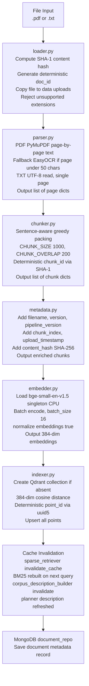

# CORPUS_GUIDE.md — Dynamic-RAG Document Corpus Reference

This guide covers everything you need to know about building, managing, and validating the document corpus for Dynamic-RAG. It is the canonical reference for anyone adding documents, debugging retrieval, or designing evaluation datasets.

---

## Table of Contents

1. [Overview](#1-overview)
2. [Supported File Types](#2-supported-file-types)
3. [Folder Structure](#3-folder-structure)
4. [Document Naming Conventions](#4-document-naming-conventions)
5. [The Ingestion Pipeline](#5-the-ingestion-pipeline)
6. [Why Deterministic IDs Matter](#6-why-deterministic-ids-matter)
7. [Adding Documents — Three Methods](#7-adding-documents--three-methods)
8. [OCR for Scanned PDFs](#8-ocr-for-scanned-pdfs)
9. [Verifying Ingestion](#9-verifying-ingestion)
10. [Corpus Design for Evaluation](#10-corpus-design-for-evaluation)
11. [Removing Documents](#11-removing-documents)
12. [Updating KNOWLEDGE_BASE_DESCRIPTION](#12-updating-knowledge_base_description)

---

## 1. Overview

The Dynamic-RAG corpus is the set of documents indexed in Qdrant as 384-dimensional cosine-similarity vectors (produced by `BAAI/bge-small-en-v1.5`). Each document is split into overlapping text chunks; every chunk is stored as a Qdrant point carrying both the vector and a structured payload (document ID, chunk ID, page number, filename, content hash, and pipeline version).

**Current corpus state (as of latest evaluation run):**

| Metric | Value |
|---|---|
| Total documents | 30 |
| Total chunks | 4,888 |
| Vector dimension | 384 |
| Distance metric | Cosine |
| Qdrant collection | `dynamic_rag_documents` |
| Topic coverage | Geopolitics, world affairs, Indian history, defense, economic sanctions, global trade |

### How the corpus affects the planner

Every time a query arrives, the LLM planner receives an up-to-date natural-language description of the corpus before it decides which route to take (`internal_rag`, `web_research`, `hybrid`, `memory`, or `direct_generation`). This description is built dynamically by `corpus_description_builder` (see `src/knowledge/corpus_description.py`), which scrolls Qdrant, reads the first chunk of each document, and assembles a one-document-per-line summary.

This means **you never need to manually update the planner's knowledge of what is in the corpus**. When you ingest a new document, the pipeline automatically calls `corpus_description_builder.invalidate()`, and the planner will read the refreshed description on the very next query. The only exception is if Qdrant is temporarily unavailable, in which case the system falls back to the static `KNOWLEDGE_BASE_DESCRIPTION` string in `.env` (see [Section 12](#12-updating-knowledge_base_description)).

---

## 2. Supported File Types

| Type | Extension | Parsing Method | Notes |
|---|---|---|---|
| Digital PDF | `.pdf` | PyMuPDF (`fitz`) text extraction, page by page | Standard for all PDFs with selectable text |
| Scanned PDF | `.pdf` | EasyOCR fallback (automatic) | Triggered when a page yields fewer than 50 characters of selectable text; see [Section 8](#8-ocr-for-scanned-pdfs) |
| Plain text | `.txt` | Python `open()` with UTF-8 encoding | Entire file treated as a single page |
| DOCX | `.docx` | Planned, not yet implemented | Convert to PDF or TXT in the meantime |
| HTML | `.html` | Planned, not yet implemented | Convert to TXT in the meantime |
| Markdown | `.md` | Planned, not yet implemented | Rename to `.txt` as a temporary workaround |

Files with unsupported extensions are rejected at the loader stage with a `ValueError` before any disk write occurs.

---

## 3. Folder Structure

Use this layout for all corpus-related files. The `uploads/` and `tmp_uploads/` directories are auto-managed by the ingestion pipeline; everything else is human-managed.

```
data/
├── raw/
│   ├── primary/                    <- main answer-source documents (subfolders by topic are fine)
│   │   ├── geopolitical_events/
│   │   ├── defense_military_intelligence/
│   │   ├── economic_sanctions/
│   │   ├── conflict_escalation/
│   │   ├── election_foreign_policy/
│   │   ├── geopolitical_risk_index/
│   │   ├── geopolitical_sentiment/
│   │   ├── geopolitics_news_intelligence/
│   │   ├── global_crisis/
│   │   ├── global_trade_supply_chain/
│   │   └── ... (add category folders as needed)
│   ├── noise/                      <- distractor documents for testing retrieval precision
│   └── unanswerable/               <- optional: docs that should NOT answer benchmark queries
├── uploads/                        <- AUTO-MANAGED: ingested files stored here with content-hash IDs
├── tmp_uploads/                    <- AUTO-MANAGED: temporary staging area during API uploads
└── processed/                      <- optional: store parsed/chunked artifacts for inspection
    ├── parsed/
    ├── chunks/
    └── embeddings/
```

### What goes where

- `raw/primary/`: The documents you want the system to answer from. Organize into topic subfolders. The pipeline recurses into all subfolders automatically.
- `raw/noise/`: Distractor documents — semantically similar to primary docs but not direct answer sources. Used to test whether retrieval returns the right chunks rather than plausible-but-wrong ones.
- `raw/unanswerable/`: Documents (or an empty folder) representing topics your benchmark queries should NOT be answerable from. Useful for measuring abstention behavior.
- `uploads/`: Do not put files here manually. The loader copies every ingested file here under a deterministic content-hash filename (`doc_<12-char-sha1>.<ext>`). This is the permanent record of what has been indexed.
- `tmp_uploads/`: Used only by the API upload route as a staging area. Files are deleted immediately after ingestion completes (or fails).
- `processed/`: Entirely optional. Useful for debugging — you can dump parsed page text, chunk JSON, or embedding arrays here for inspection. The pipeline does not read from or write to this folder automatically.

---

## 4. Document Naming Conventions

### Use descriptive names with category and version

Good:
```
india_profile_v1.txt
nato_history_2024.pdf
geopolitical_risk_index_q1_2025.pdf
economic_sanctions_russia_2022.txt
defense_spending_global_2024.pdf
```

Avoid:
```
doc1.pdf
sample.txt
test_document.pdf
new.txt
final_version2_revised.pdf
```

### Why naming matters: the content-hash document ID

When a file is ingested, the loader computes a **SHA-1 hash of the file's raw bytes** and uses the first 12 hex characters as the document ID:

```python
file_hash = hashlib.sha1(source_path.read_bytes()).hexdigest()[:12]
document_id = f"doc_{file_hash}"
```

This means:

- **Renaming a file does not change its document ID** — the ID is derived from content, not the filename. If you re-ingest a renamed file with identical content, it will produce the same ID and upsert the same Qdrant points idempotently.
- **Modifying a file (even a single byte) changes its document ID** — the modified file will be treated as a new document and produce new chunk IDs. The old chunks remain in Qdrant until manually deleted.
- **The original filename is stored in chunk metadata** — so descriptive filenames still matter for human readability in the corpus description and in retrieval results.

The content-hash design is what makes the evaluation gold set stable: chunk IDs never shift unless the document content actually changes.

---

## 5. The Ingestion Pipeline

Every document — regardless of which ingestion method is used — passes through the same 8-stage pipeline implemented in `src/ingestion/pipeline.py`.



### Stage summary

| Stage | File | Key output |
|---|---|---|
| Load | `src/ingestion/loader.py` | `document_id`, file at `data/uploads/` |
| Parse | `src/ingestion/parser.py` | List of `{page_number, text}` dicts |
| Chunk | `src/ingestion/chunker.py` | List of chunk dicts with deterministic `chunk_id` |
| Enrich metadata | `src/ingestion/metadata.py` | Chunks with `filename`, `content_hash`, `timestamp`, `pipeline_version` |
| Embed | `src/ingestion/embedder.py` | Chunks with `embedding` (384-float list) |
| Index | `src/ingestion/indexer.py` | Points upserted into Qdrant |
| Invalidate caches | `src/ingestion/pipeline.py` | BM25 and corpus description reset |
| Persist to Mongo | `src/database/repositories.py` | Document record in MongoDB `documents` collection |

---

## 6. Why Deterministic IDs Matter

Both the document ID and the chunk ID are derived deterministically from content — not from timestamps, random UUIDs, or file paths.

**Document ID formula:**
```
doc_id = "doc_" + SHA1(file_bytes)[:12]
```

**Chunk ID formula:**
```
chunk_id = "chunk_" + SHA1(f"{doc_id}|{page}|{position}|{text}")[:12]
```

**Qdrant point ID formula:**
```
point_id = uuid5(NAMESPACE_URL, chunk_id)   # deterministic UUID
```

### Why this design was chosen

1. **Re-ingestion is idempotent.** Running the pipeline on the same file twice upserts the same Qdrant points. No duplicates are created.

2. **Evaluation gold sets stay valid.** Your benchmark file at `evaluation/data/test_set.json` references `relevant_chunk_ids` by their `chunk_id` strings. As long as the document content does not change, those IDs remain stable across system restarts, model upgrades, or infrastructure changes.

3. **Retrieval metrics are reproducible.** Recall@K, MRR, and NDCG@K require knowing which chunk IDs are relevant. Stable IDs mean you can rerun the evaluation harness weeks later and compare results fairly.

### When IDs do change

IDs change only when the document content changes — for example, if you update a PDF, fix a typo in a TXT file, or re-export a document from a different tool. In these cases:

- The old chunks remain in Qdrant (they are not automatically deleted).
- The new version generates new chunk IDs.
- Any benchmark samples pointing to old chunk IDs become stale.

When this happens, refer to the re-anchoring workflow in [`docs/EVALUATION.md`](EVALUATION.md) to update your gold sets.

---

## 7. Adding Documents — Three Methods

All three methods run the same 8-stage ingestion pipeline internally. Choose the method that fits your workflow.

---

### Method A: CLI (recommended for batch ingestion)

The pipeline module is directly executable and recurses into all subdirectories.

**Ingest an entire directory:**
```bash
python -m src.ingestion.pipeline data/raw/primary
```

**Ingest a single file:**
```bash
python -m src.ingestion.pipeline data/raw/primary/geopolitical_events/india_profile_v1.txt
```

**Ingest a specific subdirectory:**
```bash
python -m src.ingestion.pipeline data/raw/primary/defense_military_intelligence
```

The CLI prints a summary dict for each file:
```python
{'document_id': 'doc_4a2f1b3c9e8d', 'filename': 'india_profile_v1.txt', 'chunks': 47, 'indexed': True}
```

Failed files are logged but do not halt the batch — the pipeline continues to the next file and reports `'indexed': False` with an `'error'` key.

**What happens automatically after CLI ingestion:**
- The raw file is copied to `data/uploads/doc_<hash>.txt` (or `.pdf`).
- All chunks are embedded and upserted into Qdrant.
- The BM25 index is invalidated and will rebuild on the next query.
- The corpus description cache is invalidated and will rebuild on the next planner call.
- A document record is written to MongoDB.

---

### Method B: API (recommended for production / programmatic use)

Send a `multipart/form-data` POST request to the running FastAPI server.

**Start the server first (if not already running):**
```bash
uvicorn src.api.main:app --host 127.0.0.1 --port 8000 --reload
```

**Upload a file using curl:**
```bash
curl -X POST "http://127.0.0.1:8000/documents/upload" \
  -F "file=@data/raw/primary/geopolitical_events/india_profile_v1.txt"
```

**Upload a PDF:**
```bash
curl -X POST "http://127.0.0.1:8000/documents/upload" \
  -F "file=@data/raw/primary/defense_military_intelligence/nato_history_2024.pdf"
```

**Upload from Python:**
```python
import requests

with open("data/raw/primary/india_profile_v1.txt", "rb") as f:
    response = requests.post(
        "http://127.0.0.1:8000/documents/upload",
        files={"file": ("india_profile_v1.txt", f, "text/plain")}
    )

print(response.json())
# {'document_id': 'doc_4a2f1b3c9e8d', 'filename': 'india_profile_v1.txt',
#  'status': 'indexed', 'message': '47 chunks indexed into the knowledge base.'}
```

The API endpoint (`src/api/routes/documents.py`) stages the upload to `data/tmp_uploads/`, runs the full pipeline, then deletes the temporary file. The permanent copy lands in `data/uploads/` under the content-hash filename.

**API response schema:**
```json
{
  "document_id": "doc_4a2f1b3c9e8d",
  "filename": "india_profile_v1.txt",
  "status": "indexed",
  "message": "47 chunks indexed into the knowledge base."
}
```

A `status` of `"failed"` means ingestion did not complete; check the server logs for the root cause.

---

### Method C: Streamlit UI

1. Launch the app: `streamlit run app.py`
2. Open the sidebar and locate the **Upload** section.
3. Drag and drop or browse for a `.pdf` or `.txt` file.
4. Click **Upload and Ingest**.

The UI calls the same API endpoint under the hood. Progress is shown in the sidebar. After the upload completes, the next query you send will reflect the new document.

---

## 8. OCR for Scanned PDFs

Dynamic-RAG handles scanned PDFs automatically without any manual flag or pre-processing step.

### How detection works

For every page in a PDF, the parser first attempts PyMuPDF text extraction (`page.get_text("text")`). If the resulting text is **fewer than 50 characters** after stripping whitespace, the page is classified as image-only and sent to the OCR path. The threshold is defined in `src/ingestion/parser.py`:

```python
MIN_TEXT_CHARS = 50
```

Adjust this value if you find that your scanned PDFs have faint selectable-text artifacts that fall just above 50 characters but are not actually readable.

### EasyOCR setup

EasyOCR (`easyocr==1.7.2`) is installed as part of the project requirements. However, the English OCR model weights (~200 MB) are downloaded on **first use** and cached automatically in `~/.EasyOCR/model/` (or the platform-equivalent cache directory). This download happens once — all subsequent runs use the cached model.

The OCR reader is lazy-loaded and singleton-scoped:
```python
# Only runs on the first scanned page encountered
reader = easyocr.Reader(["en"], gpu=False, verbose=False)
```

`gpu=False` ensures the system works on CPU-only machines without CUDA configuration. If you have a GPU available, set `gpu=True` in `src/ingestion/parser.py` for significantly faster OCR on large scanned documents.

### OCR page cap

To prevent extremely long processing on large scanned books, OCR is capped at 200 pages per document:

```python
OCR_PAGE_CAP = 200
```

Pages beyond the cap are skipped with a warning logged to `logs/dynamic_rag.log`. Set `OCR_PAGE_CAP = None` in `parser.py` to remove the cap for documents that require it.

### Checking whether your PDF is digital or scanned

Run this one-liner before ingesting to check what PyMuPDF can extract:

```python
python -c "
import fitz
doc = fitz.open('your_document.pdf')
for i, page in enumerate(doc):
    text = page.get_text('text').strip()
    status = 'digital' if len(text) >= 50 else 'scanned/image'
    print(f'Page {i+1}: {status} ({len(text)} chars)')
doc.close()
"
```

If most pages show `scanned/image`, the file will go through EasyOCR on ingestion.

### OCR quality tips

- **Higher source resolution = better OCR accuracy.** If you have control over the scan, use at least 300 DPI. The parser renders pages at 2x scale internally (`fitz.Matrix(2.0, 2.0)`) before passing to EasyOCR, which helps compensate for lower-DPI scans.
- **Clean scans work best.** Skewed text, stamps, handwriting, and watermarks all reduce accuracy. Use a document cleaning tool before ingestion if quality is critical.
- **Review OCR output.** After ingesting a scanned PDF, use the [Verifying Ingestion](#9-verifying-ingestion) steps to retrieve a sample query and inspect whether the extracted text looks correct.
- **Large scanned PDFs are slow.** OCR is significantly slower than direct text extraction. A 200-page scanned document may take 5 to 30 minutes on CPU depending on hardware. Plan for this in batch ingestion workflows.

---

## 9. Verifying Ingestion

After ingesting a document, use these checks to confirm it is available for retrieval.

### Check total chunks in Qdrant

**Using curl:**
```bash
curl -s http://localhost:6333/collections/dynamic_rag_documents | python -m json.tool
```

Look for `"vectors_count"` in the response to see the total number of indexed points.

**Using Python:**
```python
from qdrant_client import QdrantClient

client = QdrantClient(url="http://localhost:6333")
info = client.get_collection("dynamic_rag_documents")
print(f"Total points: {info.points_count}")
print(f"Vectors indexed: {info.vectors_count}")
```

### Check that your specific document was indexed

```python
from qdrant_client import QdrantClient
from qdrant_client.models import Filter, FieldCondition, MatchValue

client = QdrantClient(url="http://localhost:6333")

# Replace with your actual document_id
results, _ = client.scroll(
    collection_name="dynamic_rag_documents",
    scroll_filter=Filter(
        must=[
            FieldCondition(
                key="document_id",
                match=MatchValue(value="doc_4a2f1b3c9e8d")
            )
        ]
    ),
    limit=5,
    with_payload=True
)

print(f"Chunks found for this document: {len(results)}")
for point in results[:2]:
    print(point.payload["metadata"]["filename"])
    print(point.payload["text"][:200])
    print("---")
```

If you do not know the `document_id`, look in `data/uploads/` — the filename without extension is the document ID.

### Check that the corpus description reflects the new document

```python
from src.knowledge.corpus_description import corpus_description_builder

# Force a rebuild from Qdrant (bypasses any cached value)
corpus_description_builder.invalidate()
description = corpus_description_builder.get_description()
print(description)
```

The output will list all indexed documents with their first-chunk snippet. Your new document's filename should appear in the list.

### Run a test retrieval query against the new document

```python
from src.retrieval.hybrid import hybrid_retriever

# Use a query that should match content in your new document
results = hybrid_retriever.retrieve(
    query="describe the content from your new document here",
    top_k=5
)

for r in results["results"]:
    print(r["metadata"]["filename"], "|", r["chunk_id"])
    print(r["text"][:300])
    print("---")
```

If the new document's chunks appear in the top results, ingestion succeeded end-to-end.

### Check MongoDB document record

```python
from src.database.repositories import document_repo

# List all ingested documents
docs = document_repo.collection.find({}, {"document_id": 1, "filename": 1, "chunks": 1, "_id": 0})
for doc in docs:
    print(doc)
```

---

## 10. Corpus Design for Evaluation

The quality of your retrieval and generation evaluations depends directly on corpus design. A poorly structured corpus produces misleading metrics.

### The three document classes

#### Class A: Primary documents (answer sources)

These are the documents the system should answer questions from. They should contain:
- Explicit facts, definitions, and named entities
- Section headings and structured content
- Consistent terminology
- Self-contained paragraphs (each paragraph can stand alone as a potential answer)

Best examples:
- Technical manuals and configuration guides
- Government policy documents and SOPs
- Country and organization profiles
- Academic overview articles on well-defined topics
- Historical event summaries

Place these in `data/raw/primary/`.

#### Class B: Noise / distractor documents (tests retrieval precision)

These documents share vocabulary and topics with your primary docs but should NOT be the answer to your benchmark queries. They stress-test the retrieval layer — a high-precision retriever returns primary chunks at the top; a poor retriever surfaces distractor chunks instead.

Good distractor examples:
- An older version of a primary document with different facts
- A document on a related but distinct topic (e.g., if primary covers NATO, a distractor covers SEATO)
- Documents with high keyword overlap but different conclusions

Place these in `data/raw/noise/`.

#### Class C: Unanswerable documents (tests abstention)

These are documents (or an empty directory representing "nothing") that sit in the corpus but should never answer your benchmark's unanswerable queries. Their presence tests whether the system abstains correctly or hallucinates.

Place these in `data/raw/unanswerable/` or simply omit them from the primary index and rely on the benchmark's unanswerable queries against the existing corpus.

### Recommended minimum corpus for meaningful evaluation

| Item | Recommended minimum |
|---|---|
| Primary documents | 5 to 10 |
| Distractor documents | 2 to 5 |
| Benchmark queries (answerable) | 10 to 15 |
| Benchmark queries (unanswerable) | 3 to 5 |
| Total benchmark items | 15 to 20 |

This is enough for the three evaluation planes to produce statistically meaningful results. The current corpus (30 documents, 4,888 chunks) comfortably exceeds this baseline.

### Recommended benchmark query distribution

| Query type | Recommended proportion | Example |
|---|---|---|
| Direct factual | 40% | "What year was NATO founded?" |
| Keyword-heavy | 20% | "BRICS expansion 2024 members list" |
| Follow-up / conversational | 20% | "What was the impact of the policy described above?" |
| Unanswerable or ambiguous | 20% | "What is today's stock price for Reliance?" |

### Document types that work best for RAG

Retrieval works best on documents with:
- Explicit section headers (H1/H2/H3)
- Definitions ("X is defined as...")
- Named entities (proper nouns, dates, locations, organizations)
- Numbered lists and procedural steps
- Technical terminology with consistent spelling

### Document types to avoid early in development

Avoid using these as your primary corpus during initial system validation:
- Resumes and CVs (low information density per chunk)
- Informal meeting notes or chat logs
- Web pages with navigation boilerplate
- Low-structure prose without headers
- Tables exported as unformatted text

These are not wrong to ingest eventually, but they produce noisy chunking and make it harder to diagnose whether retrieval problems are algorithmic or corpus-quality issues.

---

## 11. Removing Documents

There is currently no delete API endpoint (this is a planned roadmap item). Document removal requires a manual sequence of four steps.

### Step 1: Find the document ID

The document ID is the filename (without extension) of the file in `data/uploads/`. List the directory:

```bash
# Windows PowerShell
Get-ChildItem data\uploads | Select-Object Name

# Or look at the MongoDB record
python -c "
from src.database.repositories import document_repo
docs = list(document_repo.collection.find({}, {'document_id': 1, 'filename': 1, '_id': 0}))
for d in docs:
    print(d['document_id'], '|', d['filename'])
"
```

### Step 2: Delete all chunks from Qdrant

```python
from qdrant_client import QdrantClient
from qdrant_client.models import Filter, FieldCondition, MatchValue

client = QdrantClient(url="http://localhost:6333")

doc_id = "doc_4a2f1b3c9e8d"  # replace with your document_id

result = client.delete(
    collection_name="dynamic_rag_documents",
    points_selector=Filter(
        must=[
            FieldCondition(
                key="document_id",
                match=MatchValue(value=doc_id)
            )
        ]
    )
)

print(f"Deletion result: {result}")
```

Verify the deletion:
```python
remaining, _ = client.scroll(
    collection_name="dynamic_rag_documents",
    scroll_filter=Filter(
        must=[
            FieldCondition(
                key="document_id",
                match=MatchValue(value=doc_id)
            )
        ]
    ),
    limit=1
)
print(f"Remaining chunks: {len(remaining)}")  # should be 0
```

### Step 3: Delete the file from data/uploads/

```python
from pathlib import Path

doc_id = "doc_4a2f1b3c9e8d"

for ext in [".pdf", ".txt"]:
    path = Path(f"data/uploads/{doc_id}{ext}")
    if path.exists():
        path.unlink()
        print(f"Deleted: {path}")
```

### Step 4: Invalidate caches

After deletion, the BM25 index and corpus description still reference the removed document. Invalidate both:

```python
from src.retrieval.sparse import sparse_retriever
from src.knowledge.corpus_description import corpus_description_builder

sparse_retriever.invalidate_cache()
corpus_description_builder.invalidate()

print("Caches invalidated. BM25 and corpus description will rebuild on next query.")
```

Optionally, also remove the MongoDB document record:
```python
from src.database.repositories import document_repo

doc_id = "doc_4a2f1b3c9e8d"
document_repo.collection.delete_one({"document_id": doc_id})
print("MongoDB record removed.")
```

---

## 12. Updating KNOWLEDGE_BASE_DESCRIPTION

### When it updates automatically (the normal case)

`KNOWLEDGE_BASE_DESCRIPTION` in `.env` is a **fallback override** only. Under normal operation, the planner always uses the dynamically built description from `corpus_description_builder`, not the `.env` value.

The dynamic description is rebuilt automatically whenever:
- A new document is ingested (pipeline calls `corpus_description_builder.invalidate()`)
- You manually call `corpus_description_builder.invalidate()` followed by `corpus_description_builder.get_description()`
- The server restarts (the in-memory cache is empty at startup, so the first planner call triggers a rebuild)

You do not need to touch `.env` just because you added or removed a document.

### When you might want to update KNOWLEDGE_BASE_DESCRIPTION manually

Update the `.env` fallback string when:

1. **Qdrant is regularly unavailable** and you want the planner to still make reasonable routing decisions. The dynamic builder falls back to `settings.KNOWLEDGE_BASE_DESCRIPTION` if the Qdrant scroll fails.

2. **You want to override the auto-generated description** because it is too verbose or lacks important context not captured by the first-chunk snippets. For example, if a document's first chunk is boilerplate (a copyright notice or table of contents), the auto-description will be misleading.

3. **You are deploying to a read-only replica** that does not have Qdrant access from the planner process.

To update the fallback in `.env`:
```
KNOWLEDGE_BASE_DESCRIPTION="Documents covering: (1) ... (2) ... The knowledge base does NOT contain: live data, stock prices, ..."
```

Keep the description concise (under 500 characters works well). The planner receives this in its system prompt on every query, so excessive length adds latency and token cost.

### Verifying the planner is using the correct description

```python
from src.knowledge.corpus_description import corpus_description_builder

description = corpus_description_builder.get_description()
print("=== PLANNER WILL SEE ===")
print(description)
print("=== END ===")
```

If the output lists all your documents correctly, the planner is working from the dynamic description. If it shows only the `.env` string, Qdrant may be down or the collection may be empty — check `http://localhost:6333/collections/dynamic_rag_documents` and the application logs at `logs/dynamic_rag.log`.

### Forcing a fresh rebuild without restarting

```python
from src.knowledge.corpus_description import corpus_description_builder

corpus_description_builder.invalidate()
fresh = corpus_description_builder.get_description()
print(fresh)
```

This is safe to run at any time and takes under a second on a corpus of 30 documents.
