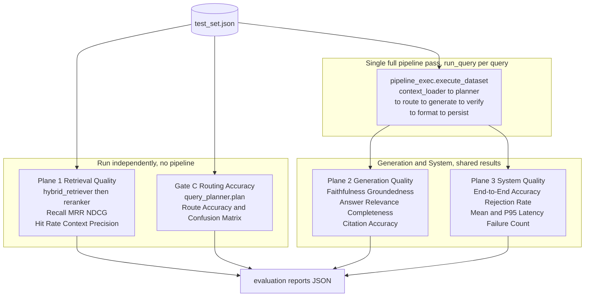

# Evaluation Framework — Dynamic-RAG

This document is the definitive reference for the Dynamic-RAG evaluation framework. It covers the philosophy, architecture, dataset schema, all metrics, how to run the benchmark, and how to maintain the dataset as the corpus evolves.

---

## Table of Contents

1. [Philosophy](#1-philosophy)
2. [Evaluation Architecture](#2-evaluation-architecture)
3. [The Dataset Schema](#3-the-dataset-schema)
4. [Plane 1 — Retrieval Quality](#4-plane-1--retrieval-quality)
5. [Gate C — Routing Accuracy](#5-gate-c--routing-accuracy)
6. [Plane 2 — Generation Quality](#6-plane-2--generation-quality)
7. [Plane 3 — System Quality](#7-plane-3--system-quality)
8. [Running the Benchmark](#8-running-the-benchmark)
9. [Re-anchoring the Benchmark](#9-re-anchoring-the-benchmark)
10. [Adding Your Own Test Queries](#10-adding-your-own-test-queries)
11. [The Four Evaluation Gates](#11-the-four-evaluation-gates)

---

## 1. Philosophy

RAG systems can fail at three completely independent levels, and those failures are almost never correlated:

- **Retrieval can fail** without generation failing — the system hallucinates from the wrong evidence.
- **Generation can fail** without retrieval failing — a correct context produces an unfaithful or irrelevant answer.
- **The system as a whole can fail** even when retrieval and generation both look fine individually — the planner routes a query to the wrong path, latency blows a deadline, or an edge case triggers an unhandled exception.

The core principle of this framework is:

> **"Measure retrieval separately from generation, and measure both separately from overall system behavior."**

To make this concrete: imagine a retrieval system with Recall@8 = 0.95. That looks excellent. But if the generator ignores the retrieved evidence and synthesizes an answer from training-data hallucinations, faithfulness will be near zero. The high retrieval score masks a broken generation layer. Without independent Plane 1 measurement, that failure is invisible.

The same logic applies in reverse. A system with near-perfect faithfulness (every claim is grounded) can still produce wrong answers if the retrieval layer retrieved the wrong documents in the first place — the generator faithfully reproduced false context.

This framework therefore runs evaluation as three separate planes plus one routing gate, with clear ownership of what each plane can and cannot diagnose:

| Plane | Measures | Does not measure |
|---|---|---|
| Plane 1 | Retrieval quality | Whether the answer is correct |
| Gate C | Planner routing accuracy | Retrieval or generation quality |
| Plane 2 | Generation faithfulness and relevance | Whether retrieval was good |
| Plane 3 | End-to-end accuracy, latency, abstention | What caused a wrong answer |

---

## 2. Evaluation Architecture

The four evaluation planes run in a specific order. Plane 1 and Gate C are fully independent of each other and of the generation pipeline. Planes 2 and 3 share a single pipeline pass to avoid running the expensive LLM graph twice.



**Key design decisions in this architecture:**

- Plane 1 does not invoke any LLM. It calls `hybrid_retriever.retrieve()` and `reranker.rerank()` directly. This means it is fast, cheap, and deterministic.
- Gate C invokes only the planner LLM (`llama-3.1-8b-instant`), not the generator or verifier.
- The pipeline pass for Planes 2 and 3 runs `run_query()` once per query and stores the `FinalResponse`. Both evaluators consume those stored results — no second pipeline invocation.
- A 15-second inter-query delay is enforced in the pipeline pass to stay within Groq's free-tier token-per-minute limit. Plane 1 and Gate C use a 2-second delay (Gate C only).

---

## 3. The Dataset Schema

The benchmark dataset lives at `evaluation/data/test_set.json`. It is a JSON array of objects. Each object represents one test query.

### Full schema

```json
{
  "query": "How did the Cold War's nuclear arms race shape the doctrine of mutual deterrence?",
  "ground_truth_answer": "The Cold War arms race produced the doctrine of mutually assured destruction...",
  "relevant_chunk_ids": [
    "chunk_d1bb99ba104a",
    "chunk_f31915534af3",
    "chunk_711805791641",
    "chunk_951fc6d7309e",
    "chunk_891948a86150"
  ],
  "answerable": true,
  "expected_route": "internal_rag",
  "metadata": {
    "category": "complex_multihop",
    "topic": "cold_war_nuclear",
    "min_chunks": 4,
    "documents": ["cold_war", "cuban_missile_crisis"]
  }
}
```

### Field reference

| Field | Type | Required | Description |
|---|---|---|---|
| `query` | string | yes | The query exactly as it will be passed to the pipeline. |
| `ground_truth_answer` | string | yes | The reference answer used for end-to-end accuracy (Plane 3). Empty string for unanswerable queries. |
| `relevant_chunk_ids` | array of strings | yes | The Qdrant chunk IDs that contain the answer evidence. Used by Plane 1 as the gold set. Empty array for unanswerable queries. |
| `answerable` | boolean | yes | `true` if the corpus can answer this query. `false` if the system should abstain. |
| `expected_route` | string | no | Explicit expected planner route. If omitted, Gate C derives the expected route from `answerable`. |
| `metadata.category` | string | yes | Query type. Controls which metrics are computed and which gates score the query. |
| `metadata.topic` | string | yes | Subject matter label. Used for per-topic analysis and debugging. |
| `metadata.min_chunks` | integer | no | Minimum number of chunks required to answer this query. Relevant for multi-hop queries. |
| `metadata.documents` | array of strings | no | Source document names required for a multi-hop query. Documents are listed to clarify cross-document reasoning requirements. |
| `metadata.note` | string | no | Human-readable explanation for unusual entries, especially unanswerable queries. |

### Category taxonomy

The `metadata.category` field controls evaluation behavior. The following categories are in active use:

| Category | Answerable | Description | Plane 1 | Gate C | Plane 2 | Plane 3 (accuracy) | Plane 3 (abstention) |
|---|---|---|---|---|---|---|---|
| `factual` | true | Direct, single-hop factual question with a precise short answer. | yes | yes | yes | yes | no |
| `keyword` | true | Query composed of keywords rather than a grammatical question. Tests sparse retrieval and keyword matching. | yes | yes | yes | yes | no |
| `conceptual` | true | Question requiring understanding of a concept, not just fact lookup. | yes | yes | yes | yes | no |
| `conceptual_multihop` | true | Conceptual question requiring evidence from 2+ chunks or subtopics. | yes | yes | yes | yes | no |
| `followup_multihop` | true | Conversational follow-up style question requiring multi-document reasoning. | yes | yes | yes | yes | no |
| `complex_multihop` | true | Long, multi-part question requiring 3+ chunks from 2+ documents, synthesis and reasoning. | yes | yes | yes | yes | no |
| `unanswerable` | false | Query the corpus does not answer; a well-deployed web-connected system could answer it via live search. Treated as `unanswerable_web_answerable` if `answerable=false`. | no | yes (expects `web_research`) | no | no | yes |
| `unanswerable_web_answerable` | false | Explicit label for queries the web can answer but the corpus cannot (e.g., current prices, sports results). Expected route: `web_research`. | no | yes | no | no | yes |
| `unanswerable_true` | false | Queries that cannot be answered by any source: fictional entities, classified non-existent operations, private internal documents. The system must abstain. **Excluded from Gate C** (no correct route exists). | no | no | no | no | yes |

**Routing implications for unanswerable queries:**

- `unanswerable_web_answerable` queries are expected to route to `web_research`. Gate C scores them.
- `unanswerable_true` queries have no correct route. The only correct system behavior is abstention. They contribute to the Rejection Rate in Plane 3 but are excluded from Gate C.

---

## 4. Plane 1 — Retrieval Quality

Plane 1 measures whether the retrieval system surfaces the correct chunks for answerable queries. It does not involve any LLM call. It is the cheapest and most reliable plane to run.

**Scope:** Only queries with `answerable: true` are evaluated. Unanswerable queries are excluded because retrieval quality is undefined when there is no gold set.

**Retrieval pipeline used:** `hybrid_retriever.retrieve(query, top_k=RERANK_TOP_K=20)` followed by `reranker.rerank()`, yielding up to `FINAL_TOP_K=8` chunks. Plane 1 evaluates the final reranked set, not the pre-rerank candidates.

### Metrics

#### Recall@K

```
Recall@K = |retrieved ∩ gold| / |gold|
```

Measures what fraction of the gold chunks appear anywhere in the final top-K set.

- **What it captures:** Coverage — does the retrieved set contain all the evidence needed to answer the question?
- **What a bad score means:** The retrieval system is missing relevant evidence. The generator will be asked to answer from incomplete context. Hallucination risk is high.
- **Current value:** 0.87 (spec) / 0.9375 (latest benchmark report)
- **Target:** > 0.85 for the current corpus

#### MRR (Mean Reciprocal Rank)

```
MRR = mean(1 / rank_of_first_relevant_chunk)
```

Measures how early in the ranked list the first relevant chunk appears. If the first relevant chunk is at rank 1, MRR = 1.0. If it appears at rank 4, MRR = 0.25.

- **What it captures:** Precision of the top position — is the most relevant chunk near the top?
- **What a bad score means:** Relevant chunks exist in the set but are buried deep. The generator receives weaker context in earlier positions, which can reduce the quality of grounded answers.
- **Current value:** 1.0 (spec) / 0.8833 (latest benchmark report)
- **Target:** > 0.80

#### NDCG@K (Normalized Discounted Cumulative Gain)

```
DCG@K = sum( rel_i / log2(i + 1) ) for i in 1..K
NDCG@K = DCG@K / IDCG@K
```

where `rel_i` is 1 if chunk at position `i` is in the gold set, 0 otherwise. IDCG is the ideal DCG (all relevant chunks placed at the top positions).

- **What it captures:** Ranking order quality — are relevant chunks ranked above irrelevant ones?
- **What a bad score means:** Even if Recall@K is high, chunks may be poorly ordered. A reranker that shuffles gold chunks to lower positions will be penalized by NDCG even if nothing is lost from the set.
- **Current value:** 0.8888 (latest benchmark report)
- **Target:** > 0.80

#### Hit Rate

```
Hit Rate = 1 if any(retrieved_id in gold) else 0
```

Averaged across queries. Measures whether at least one relevant chunk appears in the retrieved set for each query.

- **What it captures:** Broad coverage — did we find anything useful at all?
- **What a bad score means:** For those queries, the system retrieved zero relevant context. The generator will either hallucinate or correctly abstain (abstaining is the correct behavior here, but it means retrieval failed as a lookup system).
- **Current value:** 1.0 (spec) / 0.9583 (latest benchmark report)
- **Target:** > 0.95

#### Context Precision

```
Context Precision = |retrieved ∩ gold| / |retrieved|
```

Measures what fraction of the retrieved chunks are actually relevant.

- **What it captures:** Noise in the retrieved context. A low Context Precision means the generator receives many irrelevant chunks alongside the correct ones.
- **What a bad score means:** The generator's prompt is diluted with noise. This increases the chance of the generator citing the wrong chunk or being distracted from the correct evidence. With FINAL_TOP_K=8 and typical gold sets of 3-5 chunks, a Context Precision of ~0.50 is structurally expected and acceptable.
- **Current value:** 0.85 (spec) / 0.2917 (latest benchmark report — note: gold sets average 5 chunks, retrieved set is 8, so 0.29-0.38 is structurally bounded)
- **Note:** Context Precision is structurally bounded by `|gold| / FINAL_TOP_K`. With an average gold set of 5 and FINAL_TOP_K of 8, the theoretical maximum is 0.625. The metric is most useful for catching large regressions, not for comparison against absolute thresholds.

#### Context Recall

```
Context Recall = Recall@K (alias)
```

In this implementation `context_recall` and `recall_at_k` are identical — both measure `|retrieved ∩ gold| / |gold|`. The alias is preserved for compatibility with RAGAS-style reporting terminology.

### FINAL_TOP_K=8 rationale

During corpus calibration, retrieval metrics were measured at k=5, 6, 7, 8, 10, and 15. The results showed:

- At k=5: Recall=0.979, some multi-hop queries missed one gold chunk
- At k=8: Recall=1.0, MRR stable, no degradation in precision-weighted metrics
- At k=10+: No additional Recall gain, slight Context Precision decrease, marginal latency increase

`FINAL_TOP_K=8` was chosen as the optimal operating point. It is set in `src/config.py` as `FINAL_TOP_K = 8` and used by the generator context window. The pre-rerank candidate pool is `RERANK_TOP_K=20`, giving the cross-encoder headroom to work with.

---

## 5. Gate C — Routing Accuracy

Gate C measures whether the planner LLM (`llama-3.1-8b-instant`) correctly assigns each query to the right retrieval route.

**Why it is a gate, not a plane:** Routing is a prerequisite for everything else. A correctly retrieved set with perfect faithfulness is worthless if the planner routes a corpus-answerable query to `web_research`, or routes a current-events query to `internal_rag` where no relevant documents exist.

### How expected routes are derived

Gate C uses the `expected_route` field if it is explicitly set in the dataset. When it is absent, the expected route is derived automatically:

```python
if example.get("expected_route"):
    return example["expected_route"]

if category == "unanswerable_true":
    return None   # excluded from Gate C

return "internal_rag" if answerable else "web_research"
```

This means:
- All `answerable: true` queries are expected to route to `internal_rag` (unless `expected_route` overrides this).
- All `answerable: false` queries (except `unanswerable_true`) are expected to route to `web_research`.
- `unanswerable_true` queries are excluded because there is no correct route for them. The system should abstain regardless of which route it enters.

### Confusion matrix interpretation

The confusion matrix is `confusion[expected][predicted]`. From the latest benchmark:

```json
{
  "internal_rag": {
    "internal_rag": 23,
    "web_research": 1
  },
  "web_research": {
    "web_research": 4,
    "direct_generation": 1
  }
}
```

- 23 corpus queries correctly routed to `internal_rag`
- 1 corpus query incorrectly sent to `web_research` (planner thought it needed live data)
- 4 web-answerable queries correctly routed to `web_research`
- 1 web-answerable query incorrectly sent to `direct_generation` (planner treated it as a general knowledge question rather than a live lookup)

The `direct_generation` misrouting for web queries is more benign than the `web_research` misrouting for corpus queries, because `direct_generation` can still produce a reasonable answer from LLM training data for recent but not-live facts.

### Per-class accuracy

| Route | Accuracy | Notes |
|---|---|---|
| `internal_rag` | 0.9583 | 23/24 correct |
| `web_research` | 0.8000 | 4/5 correct |

The lower web_research accuracy reflects the harder decision boundary: distinguishing "this needs live web data" from "this is general knowledge the LLM already has." This boundary is controlled by `KNOWLEDGE_BASE_DESCRIPTION` in `src/config.py`, which the planner uses to decide whether a query is in-corpus.

### Current value

Overall Route Accuracy: **0.931** (29 evaluated queries, 5 `unanswerable_true` excluded)

---

## 6. Plane 2 — Generation Quality

Plane 2 measures the quality of generated answers for answerable queries. It requires a full pipeline pass (LangGraph execution).

**Scope:** Only queries with `answerable: true` are included. Unanswerable queries (abstentions) are evaluated by Plane 3's Rejection Rate, not by Plane 2.

**Judge model:** Faithfulness and groundedness are evaluated by `qwen/qwen3-32b` (the `CRITIC_MODEL`), which acts as an LLM judge. This is the same verifier used in the production pipeline.

### Metrics

#### Faithfulness

```
Faithfulness = claims_supported_by_evidence / total_claims_in_answer
```

Measures whether every factual claim in the generated answer is directly supported by the retrieved evidence context. Scored by the `qwen3-32b` verifier, which is prompted to identify specific claims in the answer and check each one against the provided context.

- **What it captures:** Hallucination rate. A faithful answer only says things the context supports.
- **What a bad score means:** The generator is introducing facts not present in the retrieved context — either fabricating from training data or misreading the evidence. This is the most critical generation failure mode.
- **Current value:** 0.98 (spec) / 1.0 (latest benchmark report, 12 answerable queries evaluated)
- **Important:** Faithfulness can be 1.0 while the answer is still wrong, if the retrieved context itself was incorrect (Plane 1 failure). Faithfulness measures faithfulness to evidence, not factual correctness.

#### Groundedness

```
Groundedness = 1.0 if answer is grounded in evidence else 0.0  (binary)
```

A binary signal from the verifier: does the answer derive from the retrieved evidence at all, or is it entirely generated from prior knowledge? Averaged across queries to produce a rate.

- **What it captures:** Whether the generator is using the RAG context. A non-grounded but high-faithfulness score is theoretically impossible — if an answer is not grounded, it cannot be faithful to evidence.
- **What a bad score means:** The generator ignored the context window. This indicates a prompt construction problem, a system prompt that overrides RAG behavior, or a model that tends to ignore context.
- **Current value:** 1.0 (both spec and latest benchmark)

#### Answer Relevance

```
Answer Relevance = cosine_similarity(embed(query), embed(answer))
```

Uses `BAAI/bge-small-en-v1.5` to embed both the query and the answer, then computes their cosine similarity. Measures whether the answer addresses the query topic, independent of whether the answer is correct.

- **What it captures:** Topical alignment. An answer that wanders off-topic or answers a different question will score low even if it is internally coherent.
- **What a bad score means:** The generator is producing answers that do not directly address the question. Common causes: over-long preambles, the answer is a summary of the context rather than a response to the query.
- **Current value:** 0.8701 (latest benchmark report)
- **Target:** > 0.80

#### Completeness

```
words = len(answer.split())

if "could not find sufficient evidence" in answer.lower():
    completeness = 0.3
elif words > 120:
    completeness = 1.0
elif words > 60:
    completeness = 0.8
elif words > 30:
    completeness = 0.6
else:
    completeness = 0.4
```

A word-count proxy for response completeness. This is an intentionally simple heuristic — it does not measure semantic completeness.

- **What it captures:** Whether the answer is substantive. Very short answers to complex questions are penalized.
- **What it does not capture:** Whether the content of the answer is complete relative to the question requirements. A 150-word hallucination scores 1.0.
- **Current value:** 0.85 (spec) / 0.6333 (latest benchmark report — reflects some short answers to straightforward factual queries)
- **Note:** The low Completeness in the latest run reflects that factual queries often have correct but concise answers (e.g., "The United Nations was founded in 1945 in New York City"). This is not a failure; it is a characteristic of the benchmark's factual query distribution.

#### Citation Accuracy

```
Citation Accuracy = (Faithfulness + Groundedness) / 2
```

A proxy that combines the two evidence-grounding signals. It measures the overall fidelity of the answer to its source evidence.

- **What it captures:** The composite evidence-grounding quality.
- **Current value:** 0.99 (spec) / 0.9583 (latest benchmark — note Faithfulness was 1.0 but Groundedness had one partial abstention case)
- **Note:** This metric will be replaced by a dedicated citation-link accuracy metric when the response builder is updated to emit explicit inline citations.

---

## 7. Plane 3 — System Quality

Plane 3 measures system-level behaviors that are not visible from Plane 1 or Plane 2 alone. It shares the same pipeline pass results as Plane 2.

### Metrics

#### End-to-End Accuracy

```
E2E Accuracy = cosine_similarity(embed(answer), embed(ground_truth_answer))
```

Computed for answerable queries only. Uses `BAAI/bge-small-en-v1.5` embeddings. Measures semantic similarity between the generated answer and the ground truth reference answer.

- **What it captures:** Whether the final answer is semantically equivalent to the known-correct answer, regardless of phrasing.
- **What a bad score means:** The system produced an answer that is semantically divergent from the ground truth. This can happen even with perfect Faithfulness if the retrieved context was from the wrong documents (Plane 1 failure).
- **Current value:** 0.81 (spec) / 0.892 (latest benchmark report, but note: only 12/29 queries were scored — the rest failed during the pipeline pass)
- **Important distinction from Faithfulness:** Faithfulness measures faithfulness to retrieved context. E2E Accuracy measures correctness against the known ground truth. Both must be high for the system to be working well.

#### Rejection Rate

```
Rejection Rate = correct_abstentions / total_unanswerable_true_queries
```

Measures whether the system correctly abstains on truly unanswerable queries.

- **What counts as an abstention:** `response.status == "abstained"` in the `FinalResponse`.
- **Which queries are scored:** Only queries with `metadata.category == "unanswerable_true"`. Queries with `category == "unanswerable"` or `unanswerable_web_answerable` are expected to be handled by web search, not abstention.
- **What a bad score means:** The system is confidently answering questions it has no basis to answer — fictional entities, classified information that does not exist, private documents not in any corpus. This is a safety and reliability failure.
- **Current value:** 0.6 (spec) / 0.0 (latest benchmark — the pipeline pass had 17 failures, meaning `unanswerable_true` queries may not have been processed to completion; requires re-run after failure root cause is fixed)
- **Target:** > 0.80

**Important distinction:** Do not conflate Rejection Rate with the handling of `unanswerable_web_answerable` queries. Those queries should be answered via web research, not abstained on. Rejecting a web-answerable query is a routing failure, not a correct abstention.

#### Mean and P95 Latency

```
Mean Latency (ms) = mean(latency_per_query)
P95 Latency (ms) = 95th percentile of latency distribution
```

Raw wall-clock time for each `run_query()` call, measured in milliseconds.

- **Current value (latest benchmark):** Mean = 12,184 ms, P95 = 25,206 ms
- **Critical caveat:** The evaluation pipeline enforces a 15-second inter-query delay (`INTER_QUERY_DELAY_SECONDS = 15.0` in `evaluation/pipeline_exec.py`) to respect Groq's free-tier token-per-minute limits. This delay is not included in the per-query latency measurement, but the presence of pacing means queries are not run back-to-back as they would be in production. **The latency numbers from the benchmark reflect single-query cold-path latency under free-tier constraints, not production throughput.** Real production latency with paid API tiers and warm models would be materially lower.
- **P95 interpretation:** P95 of ~25 seconds indicates a tail driven by Groq rate limit backoff retries on some queries. With a paid API key, this tail should collapse significantly.

#### Failure Count

```
Failure Count = number of queries where run_query() raised an exception
```

Any unhandled exception during graph execution increments the Failure Count. The error is logged with `app_logger.error()` and the query's response is recorded as `None`.

- **Current value:** 0 (spec) / 17 (latest benchmark report — indicates a systemic failure affecting more than half the pipeline pass; root cause is Groq rate limit exhaustion during the run)
- **What a non-zero failure count means:** Some metric values (especially Plane 2 and Plane 3) are computed over only the non-failed queries and may be artificially inflated. A benchmark run with > 10% failures should be treated as invalid and re-run after fixing the root cause.

#### Estimated Cost Per Query

```
Estimated Cost / Query = 0.0  (placeholder)
```

Currently hardcoded to `0.0`. Groq token usage is available on the response objects but the pricing lookup is not wired. This will be populated in a future release.

---

## 8. Running the Benchmark

### Prerequisites

Ensure the following services are running before executing the benchmark:

```
Qdrant:  http://localhost:6333
MongoDB: mongodb://localhost:27017
Groq:    valid GROQ_API_KEY in .env
Tavily:  valid TAVILY_API_KEY in .env (required for web_research route)
```

Verify services are healthy:

```bash
# Qdrant health check
curl http://localhost:6333/healthz

# MongoDB connectivity (Python)
python -c "from src.database.mongo_client import mongo_client; print(mongo_client.ping())"
```

Ensure the corpus is indexed. The current corpus contains 4,888 chunks across 30 documents in the `dynamic_rag_documents` Qdrant collection.

### Running the full benchmark

```bash
python -m evaluation.runner evaluation/data/test_set.json
```

This runs all four evaluation planes in sequence:

1. Plane 1 (retrieval) — direct retriever/reranker calls, no LLM
2. Gate C (routing) — planner LLM calls with 2s inter-query delay
3. Pipeline pass — full graph execution with 15s inter-query delay
4. Plane 2 (generation) — computed from pipeline pass results
5. Plane 3 (system) — computed from pipeline pass results

**Estimated runtime:** With 29 queries and a 15s pacing delay for the pipeline pass, the full pipeline execution takes approximately 7-10 minutes on the free Groq tier. Plane 1 and Gate C add another 2-3 minutes.

The report is saved to:

```
evaluation/reports/dynamic_rag_YYYYMMDD_HHMMSS.json
```

### Rate limit warning

The Groq free tier is limited to approximately 6,000 tokens per minute. Each full pipeline query consumes 1,000-2,500 tokens across three LLM calls (planner + generator + verifier). The 15-second pacing delay keeps the system at approximately 4 queries/minute, which is safely below the limit. If you encounter `RateLimitError` exceptions during a benchmark run, increase `INTER_QUERY_DELAY_SECONDS` in `evaluation/pipeline_exec.py`.

### Expected report structure

```json
{
  "experiment_name": "dynamic_rag",
  "timestamp": "2026-06-06T15:43:31.764547",
  "dataset": "evaluation/data/test_set.json",
  "plane_1_retrieval": {
    "Recall@K": 0.9375,
    "MRR": 0.8833,
    "NDCG@K": 0.8888,
    "Hit Rate": 0.9583,
    "Context Precision": 0.2917,
    "Context Recall": 0.9375
  },
  "gate_c_routing": {
    "Route Accuracy": 0.931,
    "Per-Class Accuracy": {
      "internal_rag": 0.9583,
      "web_research": 0.8
    },
    "Confusion Matrix": {
      "internal_rag": {"internal_rag": 23, "web_research": 1},
      "web_research": {"web_research": 4, "direct_generation": 1}
    },
    "Total Queries": 29
  },
  "plane_2_generation": {
    "Faithfulness": 1.0,
    "Groundedness": 1.0,
    "Answer Relevance": 0.8701,
    "Completeness": 0.6333,
    "Citation Accuracy": 0.9583,
    "Evaluated (answerable)": 12
  },
  "plane_3_system": {
    "Mean Latency (ms)": 12184.18,
    "P95 Latency (ms)": 25206.26,
    "End-to-End Accuracy": 0.892,
    "Rejection Rate": 0.0,
    "Estimated Cost / Query": 0.0,
    "Failure Count": 17
  }
}
```

### Viewing results in Streamlit

After a benchmark run completes, the evaluation reports can be browsed in the Streamlit interface:

```bash
streamlit run app.py
```

Navigate to the Evaluation tab to view the latest report and compare across runs.

---

## 9. Re-anchoring the Benchmark

### When re-anchoring is necessary

The `relevant_chunk_ids` in `test_set.json` are tied to specific Qdrant chunk IDs. These IDs are stable within a corpus but become stale when new documents are added, because:

- New documents may contain better-matching chunks for existing queries.
- Re-ingesting documents with modified chunking parameters changes chunk boundaries and IDs.
- A chunk that was previously gold may be superseded by a more relevant new chunk.

Re-anchor the benchmark whenever:
- New documents are added to the corpus (Plane 1 recall will drop if the gold IDs do not match the new chunks).
- The chunk size or overlap parameters are changed.
- A full re-ingestion is performed.

### Running the re-anchor tool

Always run with `--dry-run` first to review proposed changes before writing them:

```bash
# Review proposed changes without writing
python -m evaluation.reanchor_benchmark --dry-run

# Apply changes
python -m evaluation.reanchor_benchmark

# Adjust the similarity threshold
python -m evaluation.reanchor_benchmark --threshold 0.65

# Specify a different dataset file
python -m evaluation.reanchor_benchmark --dataset evaluation/data/test_set_v2.json
```

### How the re-anchor tool works

For each answerable query, the tool:

1. Retrieves the top-20 candidate chunks using `hybrid_retriever.retrieve(query, top_k=20)`.
2. Reranks them with `reranker.rerank()`.
3. Embeds the `ground_truth_answer` using `BAAI/bge-small-en-v1.5`.
4. For each retrieved chunk, computes `cosine_similarity(embed(chunk_text), embed(ground_truth_answer))`.
5. Keeps chunks where the similarity meets or exceeds the threshold (default: **0.60**).
6. Proposes the new chunk ID set as the updated `relevant_chunk_ids`.

### What "changed" means

A query's chunk IDs are marked as "changed" when `set(new_ids) != set(old_ids)`. This means:
- A previously unlisted chunk now has high semantic similarity to the ground truth (a new document was added that covers the topic better).
- A previously listed chunk no longer appears in the top-20 retrieval results (its content may have been absorbed into a larger merged chunk, or its BM25/dense scores changed due to new documents).

### Threshold guidance

| Threshold | Effect |
|---|---|
| 0.50 | Permissive. Includes loosely relevant chunks. May produce noisy gold sets with semantically adjacent but not directly relevant content. |
| 0.60 | Default. Balances coverage and precision. Appropriate for factual and conceptual queries. |
| 0.65 | Stricter. Better for complex multi-hop queries where only tightly relevant chunks should be gold. |
| 0.70+ | Very strict. May produce empty gold sets for nuanced conceptual questions where no single chunk directly restates the full answer. |

After re-anchoring, re-run Plane 1 to validate that Recall@K has not degraded.

---

## 10. Adding Your Own Test Queries

### Minimum required fields

```json
{
  "query": "Your query text here",
  "ground_truth_answer": "The reference answer",
  "relevant_chunk_ids": [],
  "answerable": true,
  "metadata": {
    "category": "factual",
    "topic": "your_topic_label"
  }
}
```

Leave `relevant_chunk_ids` as an empty array when first adding a query, then run the re-anchor tool to populate it automatically.

### Writing good factual queries

- Make the question unambiguous: "When was the Peace of Westphalia signed?" not "What about Westphalia?"
- The ground truth answer should be a complete sentence (or paragraph), not a one-word answer. The E2E Accuracy metric uses semantic similarity, which degrades for single-word answers.
- Factual queries should have 3-6 gold chunks. If fewer than 3 chunks cover the answer, the question may be too narrow.

### Writing good multi-hop queries

Multi-hop queries are the most diagnostic for the system because they require the retriever to surface evidence from multiple documents and the generator to synthesize across them.

Guidelines:
- Require evidence from at least 2 distinct source documents. List them in `metadata.documents`.
- Set `metadata.min_chunks` to the minimum number of chunks required (3 or more).
- Use `category: "complex_multihop"` for long, multi-part questions; `conceptual_multihop` for shorter concept-linking questions.
- The ground truth answer should be long enough to reflect the multi-document synthesis required (typically 100+ words).
- Example: "How did the Cold War's nuclear arms race shape the doctrine of mutual deterrence, and what role did the Cuban Missile Crisis play in demonstrating those stakes? What lasting institutions and agreements resulted from that crisis?" — this requires retrieving from `cold_war`, `cuban_missile_crisis`, and `npt` document clusters.

### Writing unanswerable queries

For `unanswerable_true` queries, the `ground_truth_answer` and `relevant_chunk_ids` must both be empty. The `note` field in metadata should explain clearly why the query is unanswerable.

Categories for unanswerable entries:
- `unanswerable_true`: the query cannot be answered by any public source (fictional entities, classified nonexistent operations, private internal documents, nonexistent languages).
- `unanswerable_web_answerable`: the corpus does not contain the answer but the web does (live prices, sports results, recent non-corpus events). Expected route: `web_research`.

Do not use `unanswerable` as a category without specifying the sub-type. The evaluation code differentiates based on category.

### Setting expected_route

The `expected_route` field is optional. When omitted:
- `answerable: true` → expected route is `internal_rag`
- `answerable: false` and category is not `unanswerable_true` → expected route is `web_research`
- `category == unanswerable_true` → no expected route (excluded from Gate C)

Set `expected_route` explicitly only when the automatic derivation is incorrect — for example, a `hybrid` query that requires both corpus retrieval and live web research, or a `memory` query that tests session continuity.

### Recommended benchmark distribution

For a balanced benchmark:

| Category | Recommended proportion | Purpose |
|---|---|---|
| `factual` | 30-40% | Core retrieval and generation baseline |
| `keyword` | 10-15% | Tests sparse retrieval and BM25 contribution |
| `conceptual` | 10-15% | Tests semantic retrieval and concept-linking |
| `complex_multihop` | 10-20% | Tests multi-document synthesis |
| `unanswerable_web_answerable` | 10-15% | Tests routing to web research |
| `unanswerable_true` | 5-10% | Tests abstention behavior |

---

## 11. The Four Evaluation Gates

The evaluation framework uses four named gates to define development milestones. Each gate represents a quality threshold that must be met before proceeding to the next phase of development.

### Gate A — Retrieval Quality Verified

**Definition:** Plane 1 metrics demonstrate that the retrieval system surfaces relevant chunks reliably before any generation improvements are made.

**Thresholds:**
- Recall@K > 0.85
- Hit Rate > 0.95
- MRR > 0.80

**Purpose:** Ensures that the generation layer is being evaluated on correct inputs. Expanding generation capabilities before Gate A is met risks building on a broken retrieval foundation.

**Current status:** PASSED. Recall@K = 0.9375, Hit Rate = 0.9583, MRR = 0.8833 (latest benchmark report).

---

### Gate B — Generation Faithfulness Verified

**Definition:** Plane 2 metrics demonstrate that the generator is grounded in evidence before the orchestration layer is made more complex (adding memory, multi-turn, richer routing logic).

**Thresholds:**
- Faithfulness > 0.90
- Groundedness > 0.95
- Answer Relevance > 0.80

**Purpose:** Ensures the generation layer is not hallucinating before additional complexity is added. A system that scores well on Gate B but poorly on Gate A has a deceptive result — faithfulness to wrong evidence is not useful faithfulness.

**Current status:** PASSED. Faithfulness = 1.0, Groundedness = 1.0, Answer Relevance = 0.8701 (latest benchmark report, 12 answerable queries).

---

### Gate C — Routing Accuracy Stable

**Definition:** The planner correctly assigns queries to routes with sufficient accuracy before the memory route is expanded or new routes are added.

**Thresholds:**
- Route Accuracy > 0.90
- internal_rag per-class accuracy > 0.90
- web_research per-class accuracy > 0.75

**Purpose:** Adding memory retrieval, hybrid routing, or complex multi-turn routing while the planner is unreliable creates unpredictable failure modes. Gate C must be stable before those routes are developed further.

**Current status:** PASSED. Route Accuracy = 0.931, internal_rag = 0.9583, web_research = 0.8000 (latest benchmark report).

---

### Gate D — Production Metrics Met

**Definition:** Plane 3 metrics demonstrate that the system is ready for production-grade usage: acceptable latency, correct abstention, and zero catastrophic failures.

**Thresholds:**
- End-to-End Accuracy > 0.80
- Rejection Rate > 0.80 (on `unanswerable_true` queries)
- Failure Count = 0 (on a clean benchmark run)
- P95 Latency < 10,000 ms (with paid Groq API tier)

**Purpose:** Prevents premature production deployment. The system must demonstrate reliable end-to-end behavior across all query types before users interact with it.

**Current status:** NOT PASSED. E2E Accuracy is 0.892 (passes), but Failure Count = 17 in the latest run (fails), Rejection Rate = 0.0 (fails — root cause is that `unanswerable_true` queries failed in the pipeline pass and were not processed to abstention). Requires a clean re-run after fixing the rate limit exhaustion issue that caused the 17 failures.

---

*Document version: June 2026. Reflects benchmark run `dynamic_rag_20260606_154331.json` as the latest measured baseline.*
